# DXNN - DEEPX NPU SDK (DX-AllSuite: DEEPX All Suite)

**DX-AllSuite**는 **DEEPX NPU** 상에서 AI inference 애플리케이션을 컴파일, 최적화, 시뮬레이션, 배포하는 전 과정을 간소화하도록 설계된 올인원 소프트웨어 플랫폼입니다. 모델 제작부터 실제 "Physical AI" 배포까지 모두 아우르는 완전한 toolchain을 통해 최적의 호환성과 강력한 하드웨어 성능을 보장합니다.

<div align="center">
  
  <p><strong>그림. DXNN SDK 전체 아키텍처 개요.</strong></p>
</div>

**주요 특징**

- **High Efficiency**: NPU 성능을 100% 끌어내는 자체 **DX-COM** compiler를 탑재했습니다. 고급 quantization(INT8 기반 Intelligent Quantization)을 활용해 정확도 손실을 최소화하면서 inference 속도를 극대화합니다.
- **Seamless Integration**: pre-processing, inference, post-processing 워크플로 전체를 잇는 지능형 video analytics pipeline을 구축합니다. **DX-Stream**(GStreamer 기반 custom plugin)을 사용하면 대규모 코드 수정 없이 복잡한 vision task를 배포할 수 있습니다.
- **Flexible Ecosystem**: **Python 및 C++ API**를 완전히 지원하며, 345개 최적화된 모델을 갖춘 **ModelZoo**를 제공합니다. Open-Source Physical AI Alliance의 리더로서, 널리 쓰이는 framework들에 대한 매끄러운 워크플로를 제공합니다.

<div align="center">
  
  <p><strong>그림. DXNN SDK 간략 아키텍처 개요.</strong></p>
</div>

## ✨ DEEPX Agent-Driven Development — dx-agent-dev (Beta)

<!-- dx-showcase:docs:cardgrid:start -->
**DEEPX Agent-Driven Development(`dx-agent-dev`) 출시 — 현재 Beta 버전입니다.** 자연어로 NPU 앱 만들기: 앱이나 모델 태스크를 자연어로 설명하면 AI 코딩 에이전트(Claude Code, Cursor, GitHub Copilot, OpenCode, Codex)가 DEEPX 지식 베이스를 end-to-end로 구동합니다: brainstorm → plan → TDD → verify, ONNX/`.pt` 컴파일부터 on-device DX-M1 NPU 배포까지. **Ultralytics** 모델 생태계와 통합된 DEEPX NPU를 위한 에이전틱 개발 워크플로이며, 아래 모든 showcase가 이 방식으로 — 프롬프트·실측 결과·전체 빌드 transcript와 함께 — 만들어졌습니다.

#### NPU 활용 AI 앱 (미니게임)

**단 20분, 약 $10의 비용으로, 자연어를 통해 DEEPX NPU용 앱을 완전 자율형으로 만드세요.** 프롬프트 하나로 만든 포즈 기반 미니게임 + 아케이드 HUD.

<table>
<tr>
 <td width="50%" align="center"><a href="dx-agent-dev-showcase/mini-game-squat-fitness/README-ko.md">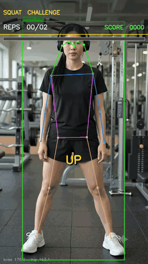</a><br><b>스쿼트 카운팅 미니게임</b><br><sub>NPU 위 스쿼트 카운팅</sub></td>
 <td width="50%" align="center"><a href="dx-agent-dev-showcase/mini-game-stretching-coach/README-ko.md">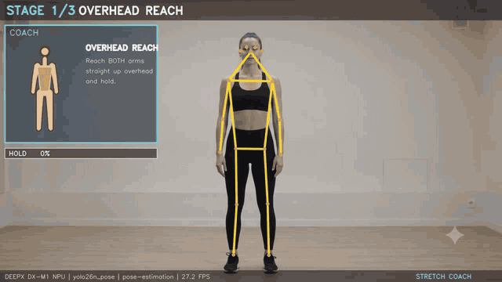</a><br><b>스트레칭 coach 미니게임</b><br><sub>포즈 가이드 아케이드 coach</sub></td>
</tr>
</table>

#### Ultralytics 생태계 통합

**Ultralytics YOLO를 한 줄로 DEEPX NPU에 올리거나, 도메인에 맞게 재학습하세요 — 모두 자연어로.** `format=deepx` export + 4-way 평가(base/재학습 × fp32-GPU / INT8-NPU); INT8 ≈ fp32, 도메인 모델은 NPU에서 더 빠릅니다.

<table>
<tr>
 <td width="50%" align="center"><a href="dx-agent-dev-showcase/ultralytics-yolo-deepx-export/README-ko.md">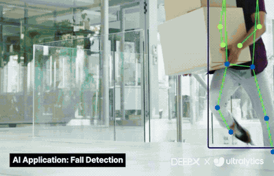</a><br><b>Ultralytics YOLO → DeepX Export</b><br><sub>한 줄 format=deepx</sub></td>
 <td width="50%" align="center"><a href="dx-agent-dev-showcase/ultralytics-yolo-deepx-export/README-ko.md">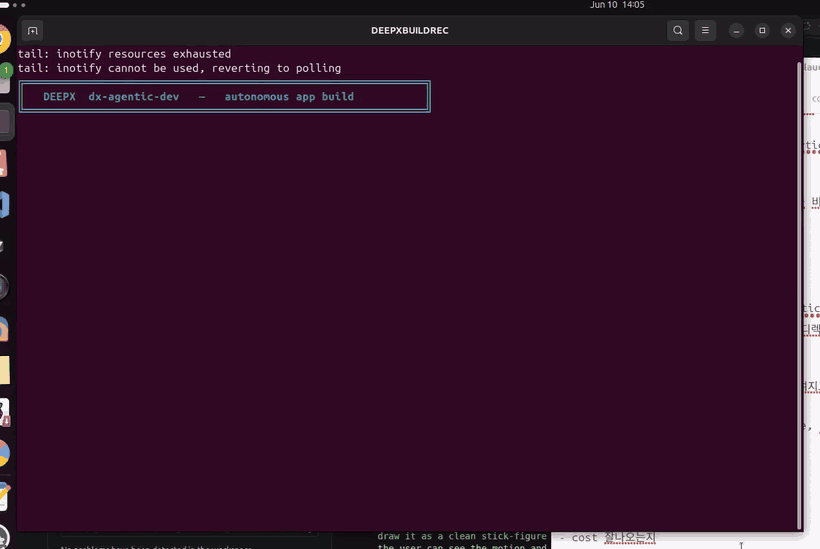</a><br><sub><b>빌드 캡처 (timelapse)</b></sub></td>
</tr>
<tr>
 <td width="50%" align="center"><a href="dx-agent-dev-showcase/ultralytics-retrain-eval-deepx-export-wildlife/README-ko.md"></a><br><b>아프리카 야생동물 모니터링</b><br><sub>사파리 카메라 재학습</sub></td>
 <td width="50%" align="center"><a href="dx-agent-dev-showcase/ultralytics-retrain-eval-deepx-export-ppe/README-ko.md">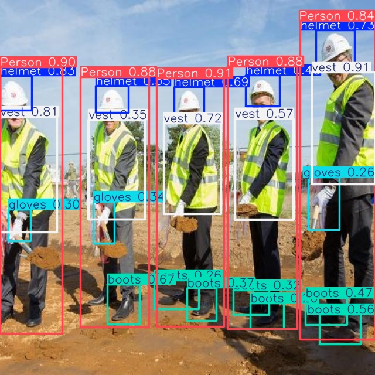</a><br><b>건설 PPE 안전</b><br><sub>현장 안전 카메라 재학습</sub></td>
</tr>
<tr>
 <td width="50%" align="center"><a href="dx-agent-dev-showcase/ultralytics-retrain-eval-deepx-export-braintumor/README-ko.md"></a><br><b>뇌종양 스크리닝</b><br><sub>의료 edge 재학습</sub></td>
 <td width="50%" align="center"><a href="dx-agent-dev-showcase/ultralytics-retrain-eval-deepx-export-pills/README-ko.md">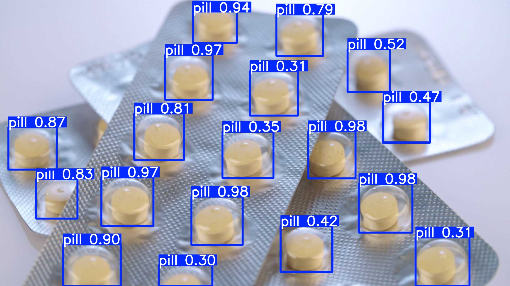</a><br><b>의약품 알약 검사</b><br><sub>제약 카운팅 재학습</sub></td>
</tr>
</table>

#### PaddlePaddle 생태계 통합

**단 하나의 간결한 프롬프트로 만드는 DEEPX NPU 실시간 영상·웹캠 OCR.** Baidu PaddlePaddle OCR(PP-OCRv5: detection → orientation → recognition)을 DX-M1 NPU에서 실행.

<table>
<tr>
 <td width="50%" align="center"><a href="dx-agent-dev-showcase/paddleocr-video-ocr/README-ko.md">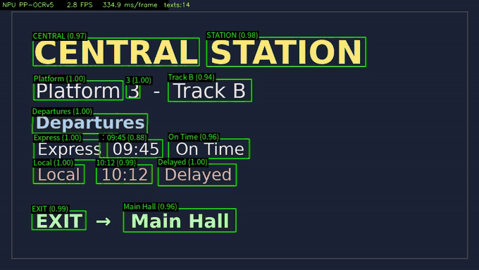</a><br><b>영상 / 웹캠 OCR (PP-OCRv5)</b><br><sub>PaddleOCR PP-OCRv5 NPU 추론</sub></td>
 <td width="50%" align="center"><a href="dx-agent-dev-showcase/paddleocr-video-ocr/README-ko.md">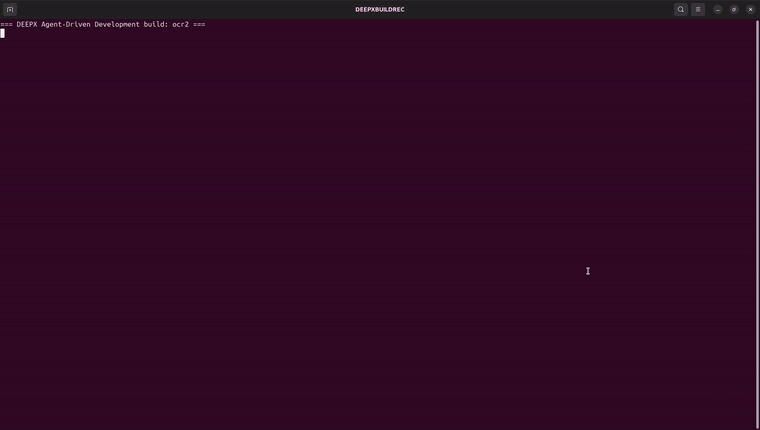</a><br><sub><b>빌드 캡처 (timelapse)</b></sub></td>
</tr>
</table>

#### RapidAI 생태계 통합

**단 하나의 간결한 자연어 프롬프트로 만드는, DEEPX NPU를 활용한 PDF → Markdown 문서 변환 앱.** RapidAI의 RapidDoc (PP-StructureV3): 레이아웃·OCR·표·수식 — PaddlePaddle로 학습된 모델을 DX-M1 NPU에서 실행. 포크 파이프라인으로부터 생성한 standalone·self-contained 앱.

<table>
<tr>
 <td width="50%" align="center"><a href="dx-agent-dev-showcase/rapiddoc-pdf2md/README-ko.md">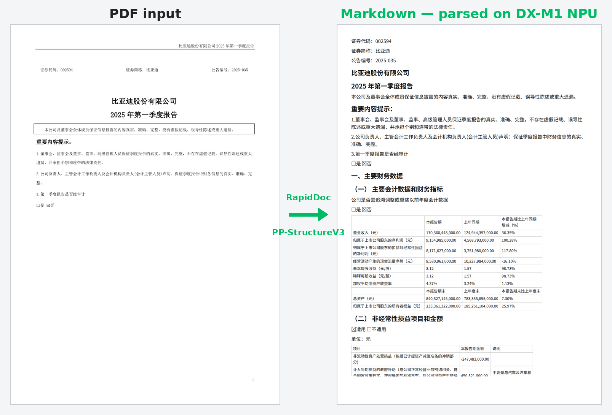</a><br><b>PDF → Markdown (문서 변환 앱)</b><br><sub>RapidDoc PP-StructureV3 NPU 추론</sub></td>
 <td width="50%" align="center"><a href="dx-agent-dev-showcase/rapiddoc-pdf2md/README-ko.md">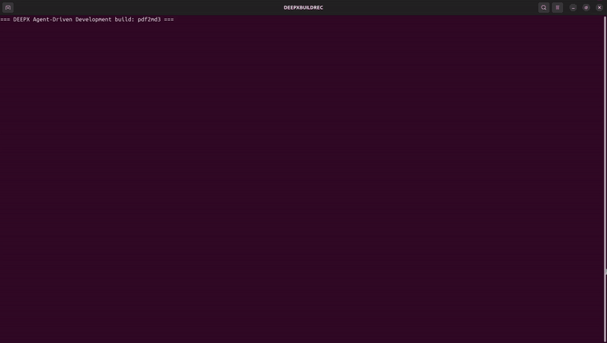</a><br><sub><b>빌드 캡처 (timelapse)</b></sub></td>
</tr>
</table>

**전체 showcase 목록 + 요약 →** [`dx-agent-dev-showcase/README-ko.md`](./dx-agent-dev-showcase/README-ko.md)  ·  **기능 설명 →** [Agent-Driven Development 문서](./docs/source/00_Agent_Driven_Development_kor.md)
<!-- dx-showcase:docs:cardgrid:end -->

> **빌드 시간 · 비용 안내** — 각 showcase에 표기된 빌드 시간, output token, 비용은
> 실제 수행된 빌드 세션 transcript(`*-session.md`)에서 측정한 **실측치**이며, 해당
> coding agent의 과금 정책으로 산정한 값입니다(추정치나 cherry-pick한 결과가 아닙니다).
> 다만 AI coding agent 특성상 동일한 prompt라도 output token 소비량이 매번 같지는
> 않으므로, 실행 환경과 model 버전에 따라 소요 시간과 비용은 달라질 수 있습니다.

## ✨ DX AI Studio — dx-ai-studio (Beta)

<div align="center">
  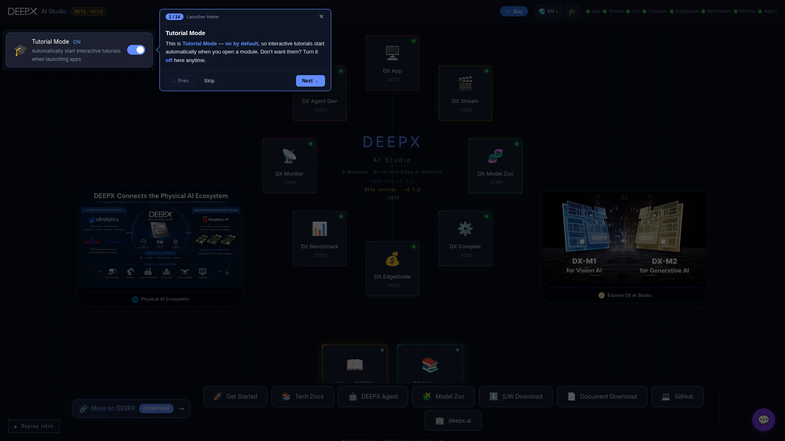
</div>

**DX AI Studio 출시 — 현재 Beta 버전입니다.** DEEPX NPU 위에서 개발하기 위한 올인원 desktop web workspace로, 8개의 전문 도구를 브라우저 하나에서 단일 명령으로 실행합니다 — **DX Model Zoo**(모델 카탈로그), **DX Compiler**(ONNX/`.pt` → `.dxnn`), **DX App**(추론 + 원클릭 **Run Demo**), **DX Stream**(GStreamer 파이프라인), **DX Benchmark**, **DX Monitor**(실시간 NPU telemetry), **DX EdgeGuide**(실측 benchmark 데이터 기반 배포 플래너), **DX Agent Dev**(위의 agent-driven builder). 모델을 컴파일하고, 큐레이션된 demo를 실행하고, 파이프라인을 스트리밍하고, NPU 사용률을 실시간으로 확인 — 모두 on-device로 이루어집니다.

**스튜디오 살펴보기 →** [`dx-ai-studio/README.md`](./dx-ai-studio/README.md)  ·  **설치 및 실행 →** [Installation and Launch](./dx-ai-studio/docs/source/01_Installation_and_Launch.md)

## ✨ DX-Benchmark — dx-benchmark (Beta)

DEEPX NPU에서의 재현 가능한 YOLO26 성능 벤치마크 — 하나의 표준 절차로 모든 Host PC + NPU
조합에서 측정합니다. 두 계층을 측정합니다: **Model-Level**(`run_model`) — **Latency**
(single-core, sync)와 **Throughput**(multi-core, async) — 그리고 **E2E Pipeline**(DX-Stream) — **Single-Stream** FPS와 **Multi-Stream** 채널 수용량. 두 계층 모두
ONNX-Runtime ON/OFF 자동 비교와 thermal-throttle 감지를 수행하고, 환경 간·버전 간 비교용
interactive dashboard로 렌더링됩니다. 6개 hardware 환경 측정 결과를 함께 제공하며, 이 결과로
만든 dashboard는 [DX AI Studio](./dx-ai-studio/README.md)의 **DX Benchmark** 화면에서도 확인할 수
있습니다.

**시작하기 →** [`dx-benchmark/README.md`](./dx-benchmark/README.md)  ·  **성능 분석 →** [`dx-benchmark/docs/ANALYSIS_KOR.md`](./dx-benchmark/docs/ANALYSIS_KOR.md)

## 시작하기

**DX-AllSuite**는 사용 목적에 따라 두 가지 환경을 제공합니다. 필요에 맞는 환경을 선택해 시작하세요.

### 한 줄 설치 (one-line install)

이 repository를 clone하지 않고 개별 component를 설치할 수 있습니다.

```bash
# DX-Compiler (x86_64 Host PC)
curl -fsSL https://raw.githubusercontent.com/DEEPX-AI/dx-compiler/main/oneline-install.sh | sh

# DX-Runtime (DEEPX NPU가 장착된 target device: NPU driver + dx_rt + firmware)
curl -fsSL https://raw.githubusercontent.com/DEEPX-AI/dx-runtime/main/oneline-install.sh | sh

# DX-ModelZoo
curl -fsSL https://raw.githubusercontent.com/DEEPX-AI/dx-modelzoo/main/oneline-install.sh | sh
```

DX-ModelZoo는 ONNX runtime backend를 제공하는 `cpu` extra를 기본으로 설치합니다.
CUDA backend가 필요하면 `DX_EXTRA=gpu`를 지정하십시오.

버전을 고정하려면 `DX_VERSION`(DX-Compiler / DX-ModelZoo) 또는 `DX_REF`(DX-Runtime)를,
설치 경로를 바꾸려면 `DX_INSTALL_DIR`을 사용합니다.

```bash
curl -fsSL https://raw.githubusercontent.com/DEEPX-AI/dx-compiler/main/oneline-install.sh | DX_VERSION=v2.4.1 sh
```

!!! note "DX-Runtime 참고"
    설치 후 NPU driver를 로드하려면 재부팅이 필요합니다. NPU device가 감지되지 않으면
    firmware update 단계는 건너뛰므로, 재부팅 후 같은 명령을 다시 실행해 완료하십시오.
    한 줄 설치는 `dx_fw`, `dx_rt`, `dx_rt_npu_linux_driver`를 대상으로 하며,
    `dx_app`과 `dx_stream`은 아래 전체 설치 가이드를 따릅니다.

전체 suite(모든 component, source build, Docker)가 필요하면 아래 환경별 가이드를 사용하십시오.

### AI Model Compile 환경 (Host PC)

학습된 AI 모델을 DEEPX NPU 전용 binary로 변환·최적화하는 데 사용하는 환경입니다.

- **Arch**: x86_64
- **OS**: Ubuntu 26.04 / 24.04 / 22.04 / 20.04 (LTS), Fedora 42-45, Red Hat Enterprise Linux 9-10, CentOS Stream 9-10
- **Hardware**: x86_64 Host PC
- **Software**: Python 3.8~3.14, CUDA (시뮬레이션용, 선택)
- **Key Tasks**: AI 모델(`.onnx`) 컴파일, Quantization, `.dxnn` 생성
- **Action**: DX-Compiler Local Installation Guide [Link](./docs/source/02_Setting_Up_Environment.md)

### AI Model Runtime 환경 (Target Device)

DEEPX NPU가 물리적으로 장착된 디바이스에서 inference를 수행하고 애플리케이션을 실행하는 환경입니다.

- **Arch**: x86_64, aarch64
- **OS**: Ubuntu 26.04 / 24.04 / 22.04 / 20.04 (LTS), Debian 13 / 12
- **Hardware**: Host PC / Target Board (DEEPX NPU 필요)
- **Software**: Python 3.8+
- **Key Tasks**: `.dxnn` 모델 실행, 실시간 데이터 inference, 리소스 관리
- **Action**: DX-Runtime Installation Guide [Link](./docs/source/02_Setting_Up_Environment.md)

!!! warning "활성화 필요"
    설치 후 NPU Driver를 커널에 올바르게 로드하려면 시스템 재부팅이 필수입니다.
    ```Bash
    sudo reboot
    ```

## 지원 모델

DX-AllSuite는 우리 NPU에서 최고 성능을 내도록 최적화된, 업계 표준 AI 아키텍처를 폭넓게 지원합니다.

- **Image Classification**: AlexNet, ResNet/ResNeXt/WideResNet, MobileNet, EfficientNet (Lite/V2), ViT/DeiT/BEiT, MobileViT, FastViT, CasViT, RegNet, ShuffleNet, VGG 등.
- **Object Detection**: YOLO 계열 (YOLOv3–YOLOv11, YOLOX, YOLO26), SSD, EfficientDet, NanoDet, DamoYOLO.
- **Segmentation**: DeepLabV3/DeepLabV3+, SegFormer, BiSeNet, UNet, YOLACT, 그리고 YOLO 기반 segmentation 변형 (YOLOv5/YOLOv8/YOLO26).
- **Advanced Vision Tasks**: Face analysis (Detection, Recognition, Landmarks, Attributes), Human/Hand Pose Estimation, Low-Light Enhancement, Image Denoising, Super Resolution, Depth Estimation, Oriented Object Detection (OBB), Zero-Shot Instance Segmentation, Person Attributes.

!!! note "Pro Tip"
    모델을 직접 컴파일하는 대신, [**DEEPX ModelZoo**](https://developer.deepx.ai/modelzoo/)에서 **345개 최적화된 모델** 중 바로 사용 가능한 binary를 다운로드할 수 있습니다.

## 문서 내비게이션

처음 사용하는 분께는 다음 순서로 문서를 보시길 권장합니다.

- **[소개](./docs/source/index.md)**: DX-AS 개요 및 구성요소 설명
- **★ [Agent-Driven Development (Beta)](./docs/source/00_Agent_Driven_Development_kor.md)**: AI coding agent(Claude Code, Cursor, GitHub Copilot, OpenCode, Codex CLI)로 자연어 프롬프트를 사용해 DEEPX 앱 만들기
- **[DX-Benchmark (Beta)](./dx-benchmark/README.md)**: 재현 가능한 YOLO26 NPU 벤치마크(Model-Level + E2E Pipeline)와 interactive 성능 dashboard
- **Step 1. [DX-AllSuite Architecture Overview](./docs/source/01_DX-AllSuite_Architecture_Overview_kor.md)**: SDK 개요, 모듈 설명, ModelZoo 사용법
- **Step 2. [Setting Up Environment](./docs/source/02_Setting_Up_Environment_kor.md)**: Local/Docker 설치 상세 및 트러블슈팅
- **Step 3. [Running Your First NPU Model](./docs/source/03_Running_Your_First_NPU_Model_kor.md)**: 단계별 hands-on 스크립트 실행
- **Step 4. [Checking Version Compatibility](./docs/source/04_Version_Compatibility_kor.md)**: SDK, Driver, Firmware 의존성 매트릭스
- **Step 5. [FAQ Troubleshooting Guide](./docs/source/05_FAQ_Troubleshooting_Guide_kor.md)**: 환경 충돌 및 GUI 세션(X11) 오류 해결책

## 지원

DEEPX 기술 지원팀이 매끄러운 AI 솔루션 구축을 돕습니다.

- **DEEPX Developer Portal**: [https://developer.deepx.ai](https://developer.deepx.ai) (최신 문서 및 SDK 릴리스 노트)
- **Technical Support**: [tech-support@deepx.ai](mailto:tech-support@deepx.ai) (커스텀 모델 배포 및 하드웨어 통합 상담)

Copyright © DEEPX. All rights reserved.

---
