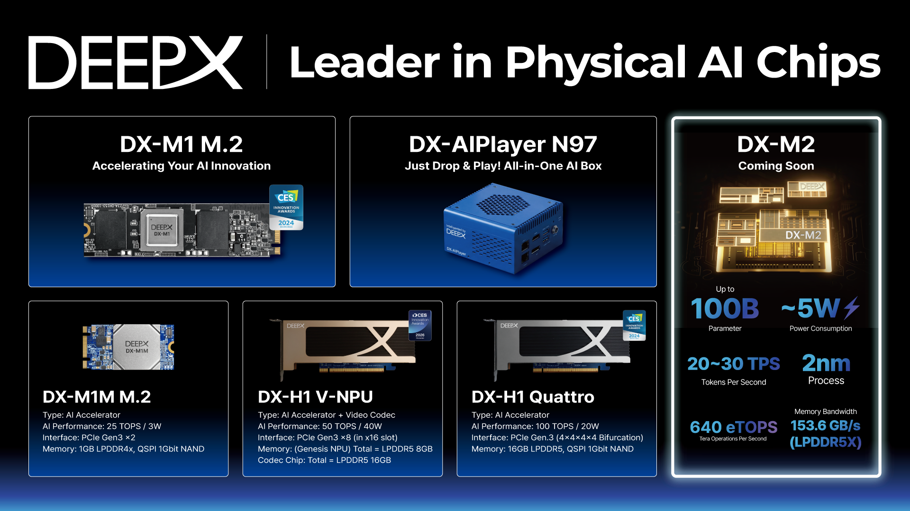
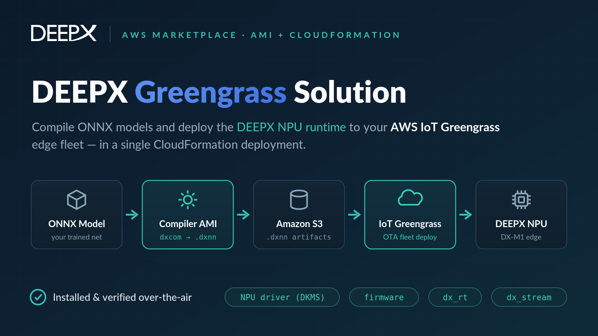
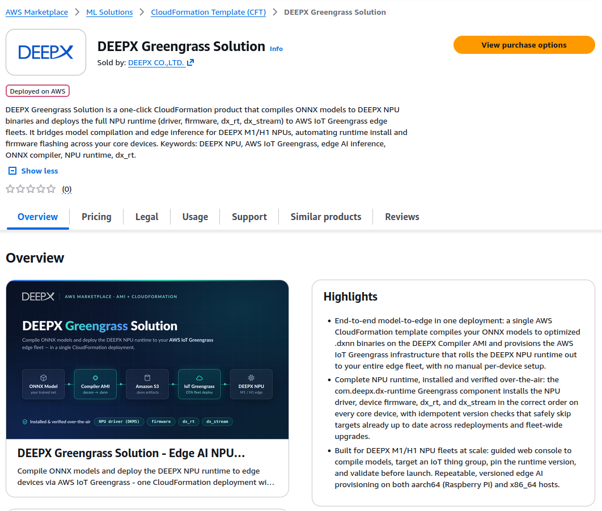
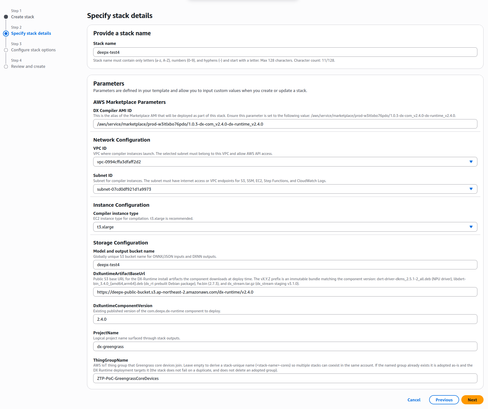
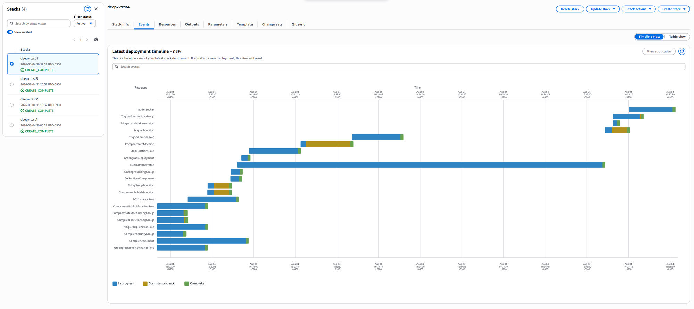
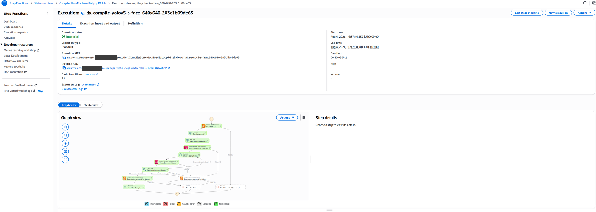
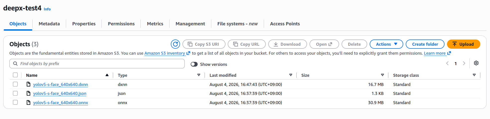
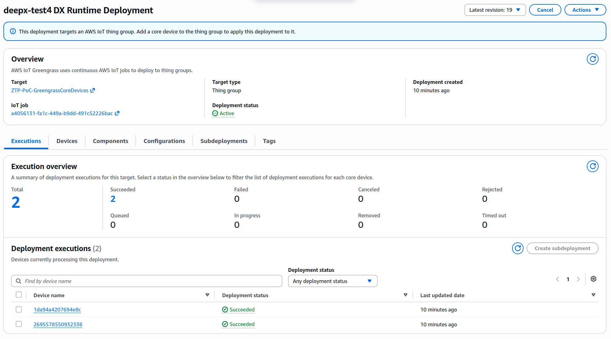
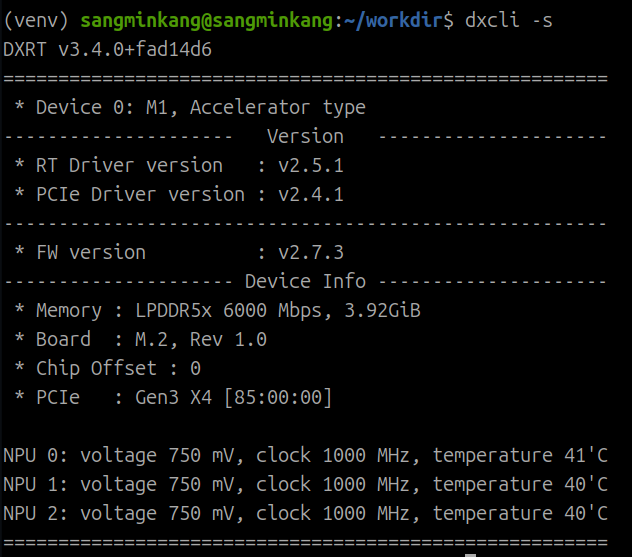
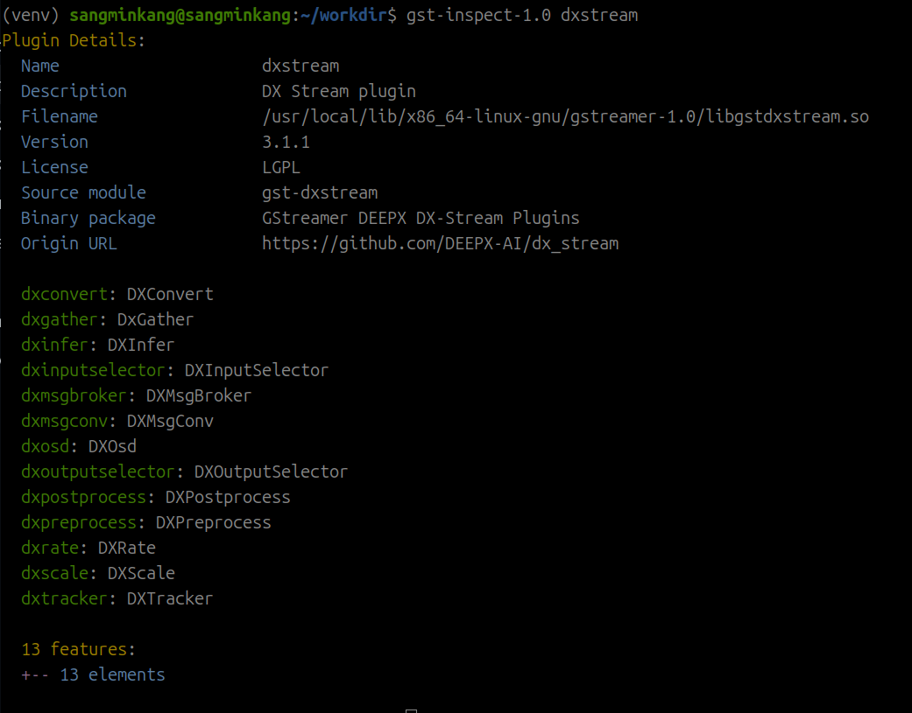

# AWS Marketplace 사용 가이드

## 개요

엣지 환경에 딥러닝 모델을 배포하는 과정에는 여러 단계의 수작업이 필요합니다. 디바이스마다 다른 리눅스 배포판과 커널 버전에 맞춰 NPU 드라이버를 빌드하고, 펌웨어와 런타임 버전을 맞추고, 클라우드에서 학습한 모델을 타겟 NPU 아키텍처에 맞게 변환해야 합니다. 디바이스 수가 늘어날수록 이 과정은 반복되고, 버전 불일치로 인한 장애 가능성도 함께 커집니다.

이 문서는 AWS Marketplace에 등록된 **DEEPX Greengrass Solution**을 사용하여 이 과정을 자동화하는 방법을 설명합니다. CloudFormation 스택 하나를 배포하면, 표준 ONNX 모델을 Amazon S3에 업로드하는 것만으로 DEEPX NPU 전용 포맷(DXNN)으로의 컴파일이 자동 수행되고, AWS IoT Greengrass V2를 통해 엣지 디바이스에 필요한 드라이버·펌웨어·런타임이 원격으로 설치됩니다. Marketplace 구독부터 엣지 디바이스에서의 배포 확인까지 전체 과정을 단계별로 다룹니다.

DEEPX는 엣지 환경을 위한 저전력 AI 반도체(NPU)를 개발하는 회사입니다. 이 솔루션이 지원하는 **DX-M1**은 M.2 폼팩터의 AI 가속기로, 3W급 전력으로 25 TOPS의 연산 성능을 제공합니다. Raspberry Pi 5와 같은 arm64 호스트나 x86_64 산업용 PC의 M.2 슬롯에 장착해 객체 인식·얼굴 인식·OCR과 같은 비전 모델을 실시간으로 추론할 수 있으며, 전력과 공간 제약이 있는 로보틱스, 드론, CCTV, 스마트 팩토리 등의 환경을 주요 대상으로 합니다.

이러한 NPU를 실제 현장에 배포하려면 드라이버·펌웨어·런타임 구성 작업이 필요한데, DEEPX Greengrass Solution은 이 부분을 AWS 인프라로 자동화합니다.



### AWS Marketplace의 DEEPX 제품

AWS Marketplace에서는 DEEPX의 다음 두 가지 제품을 제공합니다.

- **[DX-Compiler (AMI)](https://aws.amazon.com/marketplace/pp/prodview-ev6ed5omu4ulo)**: DEEPX 모델 컴파일러(`dxcom`)가 사전 설치된 Amazon Machine Image입니다. Amazon EC2 인스턴스를 직접 시작하여 `dxcom`으로 ONNX 모델을 컴파일할 수 있습니다.
- **DEEPX Greengrass Solution (CloudFormation)**: 이 문서에서 다루는 제품입니다. DX-Compiler AMI를 활용한 서버리스 컴파일 파이프라인과 AWS IoT Greengrass V2 기반의 엣지 런타임 자동 배포(ZTP)를 CloudFormation 스택 하나로 구성합니다.

## 솔루션 아키텍처

DEEPX Greengrass Solution의 주요 특징은 다음과 같습니다.

| 특징 | 설명 |
| :--- | :--- |
| **단일 스택 배포** | AWS CloudFormation 스택 하나로 클라우드 모델 컴파일 인프라와 엣지 배포 아키텍처를 함께 구성합니다. |
| **서버리스 컴파일 파이프라인** | Amazon S3, AWS Lambda, AWS Step Functions 기반의 이벤트 구동 파이프라인이 ONNX 모델을 DEEPX NPU용 DXNN 포맷으로 변환합니다. 컴파일용 EC2 인스턴스는 작업 시에만 기동되고 완료 시 종료됩니다. |
| **런타임 자동 배포 (ZTP)** | AWS IoT Greengrass V2를 통해 NPU 드라이버(DKMS), 펌웨어, dx_rt, dx_stream 등 런타임 환경을 OTA 방식으로 자동 설치합니다. 클래식 Greengrass nucleus와 경량 디바이스용 Greengrass nucleus lite를 모두 지원합니다. |



전체 아키텍처는 클라우드에서 동작하는 컴파일 파이프라인과 엣지 디바이스로의 런타임 배포, 두 부분으로 구성됩니다. 그림 3의 번호를 기준으로 설명합니다.


### 클라우드 컴파일 파이프라인 (ONNX → DXNN)

1. 사용자가 `.onnx` 모델과 `.json` 컴파일 설정 파일 쌍을 S3 모델 버킷의 같은 디렉터리에 업로드합니다.
2. S3 `ObjectCreated` 이벤트가 발생하면 AWS Lambda 트리거 함수가 같은 디렉터리에서 짝이 되는 파일을 탐색하고, 쌍이 모두 준비된 경우에만 다음 단계로 진행합니다. 파일명 기반 해시로 실행 이름을 만들어 중복 실행을 방지합니다.
3. AWS Step Functions 컴파일 워크플로우가 시작됩니다.
4. 워크플로우가 Marketplace 구독으로 제공되는 DX Compiler AMI 기반의 Amazon EC2 인스턴스를 시작합니다. 인스턴스는 CloudFormation 파라미터로 지정한 기존 VPC/서브넷에서 실행되며, 보안 그룹은 아웃바운드 HTTPS(443)만 허용합니다.
5. AWS Systems Manager Run Command가 SSM Document에 정의된 컴파일 명령을 인스턴스에 전달합니다.
6. 인스턴스에 사전 설치된 `dxcom` 컴파일러가 실행됩니다. 이때 설정 파일의 `dataset_path`는 AMI에 포함된 캘리브레이션 데이터셋 경로(`/opt/dx-compiler/calibration_dataset`)로 자동 치환됩니다.
7. 컴파일된 `.dxnn` 바이너리가 원본 모델과 같은 S3 디렉터리에 업로드됩니다. 인스턴스는 성공·실패와 관계없이 워크플로우가 종료(Terminate)하므로 유휴 비용이 발생하지 않으며, 실행 로그는 Amazon CloudWatch Logs 로그 그룹(`/dx-compiler/<스택명>/execution`)에서 확인할 수 있습니다.

### 엣지 런타임 배포 (AWS IoT Greengrass V2)

!!! note "ZTP(Zero-Touch Provisioning)의 범위"
    이 문서에서 ZTP는 디바이스가 IoT Thing Group에 등록된 이후, 드라이버·펌웨어·런타임이 현장 작업 없이 자동 설치되는 과정을 의미합니다. 디바이스의 최초 등록(프로비저닝)은 사전 준비에서 다룹니다.

- **A.** CloudFormation 스택 배포 시 Custom Resource Lambda가 Greengrass 컴포넌트 `com.deepx.dx-runtime`을 발행합니다. 같은 버전이 이미 존재하면 재사용하는 멱등 방식이라, 한 계정에 여러 스택을 배포해도 충돌하지 않습니다.
- **B.** 발행된 컴포넌트가 Greengrass 배포(Deployment)에 포함됩니다.
- **C.** 배포 대상 IoT Thing Group은 파라미터로 지정한 그룹을 사용하거나, 미지정 시 `<스택명>-cores` 이름으로 자동 생성됩니다. 동일 이름의 그룹이 이미 있으면 삭제하지 않고 그대로 채택(adopt)합니다.
- **D.** Thing Group에 속한 각 디바이스에 `com.deepx.dx-runtime` 컴포넌트가 MQTT/TLS 기반 IoT Jobs로 배포됩니다.
- **E.** 디바이스가 DEEPX 퍼블릭 아티팩트 버킷에서 드라이버·펌웨어·런타임 패키지를 HTTPS로 내려받아 설치합니다.

컴포넌트 레시피는 클래식 Greengrass nucleus와 리소스가 제한된 디바이스를 위한 Greengrass nucleus lite를 모두 지원하도록 작성되어, Raspberry Pi급 경량 디바이스에서도 동일한 배포 파이프라인을 사용할 수 있습니다.

컴포넌트가 디바이스에서 수행하는 설치는 다음 4단계입니다.

1. **NPU 리눅스 드라이버(DKMS)**: `dxrt-driver-dkms` 패키지가 타겟 디바이스의 커널 버전에 맞춰 드라이버를 빌드·설치합니다.
2. **dx_rt 런타임**: `libdxrt-bin` 패키지가 C/C++ 기반 런타임(`dxcli`, `libdxrt.so`)을 구성합니다.
3. **펌웨어 업데이트**: `fw.bin`을 내려받아 `dxcli -u`로 NPU 펌웨어를 갱신합니다.
4. **dx_stream 미디어 파이프라인**: `dx_stream.tar.gz`를 내려받아 OpenCV/GStreamer 연동 스트리밍 환경을 구성합니다.

!!! note "설치 소요 시간"
    설치 소요 시간은 디바이스 사양과 네트워크 환경에 따라 달라지며, 저사양 arm64 디바이스에서 의존 라이브러리를 소스 빌드하는 경우 수십 분 이상 걸릴 수 있습니다.

## 사전 준비

이 솔루션을 사용하기 위해서는 다음이 준비되어야 합니다.

- AWS 계정 및 CloudFormation 스택 생성 권한
- DEEPX DX-M1 M.2 모듈이 장착된 엣지 디바이스 — 예: Raspberry Pi 5(arm64) 또는 x86_64 Ubuntu 호스트
- 타겟 디바이스에 [AWS IoT Greengrass Core V2](https://docs.aws.amazon.com/greengrass/v2/developerguide/getting-started.html) 설치 및 IoT Thing Group 등록 완료 — 클래식 nucleus와 nucleus lite 모두 사용 가능합니다
- 배포할 학습 완료 ONNX 모델
- 컴파일러 EC2 인스턴스를 실행할 기존 VPC와 서브넷 — 서브넷은 인터넷 액세스 또는 S3·SSM·EC2·Step Functions·CloudWatch Logs용 VPC 엔드포인트가 필요합니다 (스택은 VPC를 새로 생성하지 않습니다)

### AWS Marketplace 구독

[AWS Marketplace의 DEEPX Greengrass Solution 페이지](https://aws.amazon.com/marketplace/pp/prodview-732s46qfzuh34)에서 구독합니다. 소프트웨어 비용은 무료이며, 사용한 AWS 리소스 비용만 발생합니다(아래 **비용** 섹션 참조).



### 로컬 AWS CLI 설정 (aws configure)

이 가이드의 `aws s3 cp` 등 CLI 명령을 로컬 작업 환경에서 실행하려면 AWS CLI 인증 설정이 필요합니다. 이미 구성되어 있다면 이 절차는 건너뜁니다.

1. AWS IAM 콘솔에서 사용자용 **액세스 키**를 발급합니다 (Access Key ID / Secret Access Key).
2. `aws configure`를 실행하여 액세스 키, 기본 리전, 출력 형식을 등록합니다.

    ```bash
    aws configure
    # AWS Access Key ID [None]: <액세스 키 ID>
    # AWS Secret Access Key [None]: <시크릿 액세스 키>
    # Default region name [None]: <리전, 예: us-east-1>
    # Default output format [None]: json
    ```

3. 자격 증명이 올바르게 설정되었는지 확인합니다.

    ```bash
    aws sts get-caller-identity
    ```

    계정 ID와 사용자 ARN이 출력되면 설정이 완료된 것입니다.

## 단계 1 — CloudFormation 스택 배포

구독 후 제공되는 CloudFormation 템플릿을 실행합니다. 주요 파라미터는 다음과 같습니다.

| 파라미터 | 설명 |
| :--- | :--- |
| `ImageId` | DX Compiler AMI를 가리키는 SSM 파라미터 경로입니다. 리전별 AMI ID로 자동 해석되므로 기본값을 그대로 사용합니다. |
| `ModelBucketName` | 모델 입력과 컴파일 결과를 저장할 S3 버킷 이름입니다 (전역 고유해야 합니다). |
| `InstanceType` | 컴파일용 인스턴스 타입입니다. 기본값은 `t3.xlarge`입니다. |
| `VpcId` / `SubnetId` | 컴파일러 인스턴스를 배치할 기존 VPC와 서브넷입니다. |
| `ThingGroupName` | 배포 대상 IoT Thing Group 이름입니다. 비워두면 `<스택명>-cores`가 자동 생성되고, 기존 그룹 이름을 입력하면 해당 그룹을 채택합니다. |



스택은 S3 버킷, Lambda 함수, Step Functions 상태 머신, 최소 권한 IAM 역할, Greengrass 컴포넌트와 배포를 생성합니다. 생성 완료 후 스택의 **Outputs** 탭에서 모델 버킷 이름, 상태 머신 ARN, 로그 그룹 이름을 확인할 수 있습니다.



## 단계 2 — ONNX 모델 업로드 및 자동 컴파일

컴파일할 모델과 설정 파일을 준비합니다. 직접 학습한 모델 외에도, [DEEPX Model Zoo](https://developer.deepx.ai/modelzoo/)에서 DEEPX NPU용으로 검증된 사전 학습 모델을 다운로드하여 바로 컴파일해 볼 수 있습니다.

!!! note "dataset_path 자동 치환"
    설정 파일의 `dataset_path`는 어떤 값을 넣어도 컴파일 시 AMI에 내장된 캘리브레이션 데이터셋 경로로 자동 치환됩니다.

다음은 설정 파일의 예시입니다.

```json
{
    "inputs": {
        "input.1": [1, 3, 640, 640]
    },
    "calibration_num": 100,
    "calibration_method": "ema",
    "default_loader": {
        "dataset_path": "/mnt/datasets/widerface/WIDER_val/images",
        "file_extensions": ["jpeg", "jpg", "png", "JPEG"],
        "preprocessings": [
            {
                "resize": {
                    "mode": "pad",
                    "size": 640,
                    "pad_location": "edge",
                    "pad_value": [114, 114, 114]
                }
            },
            {
                "convertColor": {
                    "form": "BGR2RGB"
                }
            },
            {
                "transpose": {
                    "axis": [2, 0, 1]
                }
            },
            {
                "div": {
                    "x": 255.0
                }
            },
            {
                "expandDim": {
                    "axis": 0
                }
            }
        ]
    }
}
```

모델(`.onnx`)과 설정 파일(`.json`)을 S3 모델 버킷의 같은 디렉터리에 업로드합니다. 두 파일이 모두 업로드되면 파이프라인이 자동으로 시작됩니다.

```bash
aws s3 cp yolov5-s-face_640x640.onnx s3://<모델-버킷>/
aws s3 cp yolov5-s-face_640x640.json s3://<모델-버킷>/
```


Step Functions 콘솔에서 워크플로우 진행 상태를 확인할 수 있습니다. 워크플로우는 인스턴스 시작 → 컴파일 실행 → 상태 폴링 → 인스턴스 종료 순으로 진행되며, 실패 경로에서도 인스턴스를 종료하도록 설계되어 있습니다.



완료 후 원본 모델과 같은 S3 디렉터리에서 컴파일된 `.dxnn` 파일을 확인합니다. 컴파일 상세 로그는 CloudWatch Logs의 `/dx-compiler/<스택명>/execution` 로그 그룹에 기록됩니다.

```bash
aws s3 ls s3://<모델-버킷>/
```



## 단계 3 — 엣지 디바이스 런타임 배포 (ZTP)

스택 배포 시 발행된 `com.deepx.dx-runtime` 컴포넌트는 Thing Group을 대상으로 한 Greengrass 배포에 포함되어 있습니다. Thing Group에 디바이스가 등록되어 있으면 배포가 자동으로 트리거되며, 앞서 설명한 4단계 런타임 설치가 순차적으로 진행됩니다.

Greengrass 콘솔에서 배포 상태가 **Completed**가 되는 것을 확인합니다.



디바이스에서 컴포넌트 설치 로그를 확인할 수 있습니다. 클래식 nucleus는 로그 파일로, nucleus lite는 systemd 저널로 확인합니다.

```bash
# 클래식 Greengrass nucleus
sudo tail -f /greengrass/v2/logs/com.deepx.dx-runtime.log

# Greengrass nucleus lite
sudo journalctl -f -u ggl.com.deepx.dx-runtime.service
```

## 단계 4 — 배포 결과 확인

설치가 완료되면 디바이스에서 `dxcli`로 NPU 인식 상태와 펌웨어 버전을 확인합니다.

```bash
dxcli -s
```



dx_stream 데모를 실행하기 전에, 셸에서 dx_stream의 GStreamer 플러그인과 라이브러리를 찾을 수 있도록 환경 변수를 설정합니다. 다음 내용을 `~/.bashrc` 끝에 추가합니다. 아키텍처별 플러그인 경로를 자동으로 결정하므로 x86_64와 aarch64(Raspberry Pi)에서 동일하게 사용할 수 있습니다.

```bash
GST_ARCH_TRIPLET="$(gcc -dumpmachine 2>/dev/null || true)"
if [ -z "$GST_ARCH_TRIPLET" ]; then
    case "$(uname -m)" in
        x86_64) GST_ARCH_TRIPLET="x86_64-linux-gnu" ;;
        aarch64|arm64) GST_ARCH_TRIPLET="aarch64-linux-gnu" ;;
        armv7l|armv6l) GST_ARCH_TRIPLET="arm-linux-gnueabihf" ;;
        *) GST_ARCH_TRIPLET="$(uname -m)-linux-gnu" ;;
    esac
fi
GST_PLUGIN_DIR="/usr/local/lib/$GST_ARCH_TRIPLET/gstreamer-1.0"
export GST_PLUGIN_PATH="$GST_PLUGIN_DIR:$GST_PLUGIN_PATH"
export LD_LIBRARY_PATH="$GST_PLUGIN_DIR:/usr/local/share/gstdxstream/lib:$LD_LIBRARY_PATH"
export PATH="/usr/local/share/gstdxstream/bin:/usr/local/bin:$PATH"
```

변경 사항을 적용한 뒤 `gst-inspect-1.0` 명령으로 dx_stream 플러그인이 정상 등록되었는지 확인합니다.

```bash
source ~/.bashrc
gst-inspect-1.0 dxstream
```



컴파일된 `.dxnn` 모델을 디바이스로 내려받아 dx_stream 파이프라인으로 추론을 실행하면 전체 흐름이 완성됩니다.

먼저 S3 모델 버킷에서 컴파일된 `.dxnn` 모델을 디바이스로 내려받습니다.

```bash
aws s3 cp s3://<모델-버킷>/yolov5-s-face_640x640.dxnn .
```

테스트에 사용할 샘플 영상을 내려받아 압축을 해제합니다.

```bash
curl -fSLO https://sdk.deepx.ai/res/video/sample_videos.tar.gz
tar xzf sample_videos.tar.gz
```

모델 경로와 입력 영상 경로를 환경 변수로 지정합니다. `INPUT_VIDEO_PATH`는 절대 경로여야 하며, 압축 해제된 영상 중 원하는 파일을 선택합니다.

```bash
export MODEL_PATH="$PWD/yolov5-s-face_640x640.dxnn"
export INPUT_VIDEO_PATH="$PWD/dance-group.mov"
export VIDEOCONVERT_PIPELINE="videoconvert"
```

이제 dx_stream 파이프라인으로 추론을 실행합니다. `dxpreprocess`가 영상 프레임을 모델 입력 크기(640×640)로 변환하고, `dxinfer`가 NPU에서 추론을 수행합니다. `dxpostprocess`는 YOLOv5s-Face 후처리 라이브러리로 검출 결과를 해석하고, `dxosd`가 바운딩 박스를 영상 위에 그려 `fpsdisplaysink`로 FPS와 함께 화면에 출력합니다.

```bash
gst-launch-1.0 urisourcebin uri=file://$INPUT_VIDEO_PATH ! decodebin ! \
    dxpreprocess \
        preprocess-id=1 \
        resize-width=640 \
        resize-height=640 ! \
    queue max-size-buffers=1 ! \
    dxinfer \
        preprocess-id=1 \
        inference-id=1 \
        model-path=$MODEL_PATH ! \
    queue max-size-buffers=1 ! \
    dxpostprocess \
        inference-id=1 \
        library-file-path=/usr/local/share/gstdxstream/lib/libpostprocess_yolov5s_face.so \
        function-name=PostProcess ! \
    queue max-size-buffers=1 ! \
    dxosd ! \
    $VIDEOCONVERT_PIPELINE ! fpsdisplaysink sync=false
```


## 비용

솔루션의 소프트웨어 라이선스 비용은 무료이며, 사용하는 AWS 리소스에 대한 비용이 발생합니다.

- **Amazon EC2**: 컴파일러 인스턴스(기본 `t3.xlarge`)는 컴파일 작업 중에만 실행되고 성공·실패와 관계없이 종료되므로, 실제 컴파일 시간에 대해서만 과금됩니다. 인스턴스 타입별 요금은 [EC2 온디맨드 요금](https://aws.amazon.com/ko/ec2/pricing/on-demand/)을 참조하세요.
- **Amazon S3 / AWS Lambda / AWS Step Functions**: 모델 파일 저장 및 파이프라인 실행에 소량의 비용이 발생합니다.
- **AWS IoT Greengrass**: 디바이스 수에 따른 요금은 [AWS IoT Greengrass 요금](https://aws.amazon.com/ko/greengrass/pricing/)을 참조하세요.

!!! note "실측 비용 참고"
    YOLOv5s-Face 모델 기준 실측 시, 기본 `t3.xlarge` 인스턴스에서 컴파일에 약 12분 30초가 소요되었고, 인스턴스 시작부터 종료까지의 과금 시간은 약 17분이었습니다. 미국 동부(버지니아 북부, us-east-1) 리전 온디맨드 요금(시간당 $0.1664) 기준 1회 컴파일 비용은 EBS 볼륨을 포함해 약 $0.05 수준입니다. 소요 시간과 비용은 모델 크기와 리전에 따라 달라질 수 있습니다.

## 리소스 정리

과금을 방지하려면 실습 후 다음 순서로 리소스를 정리합니다.

1. CloudFormation 콘솔에서 스택을 삭제합니다. 스택이 생성한 Thing Group과 컴포넌트 버전은 함께 정리되지만, 기존에 있던 그룹을 채택한 경우에는 삭제되지 않습니다.
2. 모델 버킷은 데이터 보호를 위해 스택 삭제 후에도 유지(Retain)됩니다. 더 이상 필요 없다면 버킷을 비운 뒤 직접 삭제합니다.
3. AWS Marketplace 구독이 더 이상 필요하지 않다면 [구독 관리](https://aws.amazon.com/marketplace/library)에서 해지합니다.
4. (선택) Greengrass 콘솔에서 배포를 수정해 디바이스에서 컴포넌트를 제거합니다.

## 참고 링크

- [DEEPX Greengrass Solution — AWS Marketplace](https://aws.amazon.com/marketplace/pp/prodview-732s46qfzuh34)
- [DX-Compiler (AMI) — AWS Marketplace](https://aws.amazon.com/marketplace/pp/prodview-ev6ed5omu4ulo)
- [AWS IoT Greengrass V2 개발자 안내서](https://docs.aws.amazon.com/greengrass/v2/developerguide/what-is-iot-greengrass.html)
- [AWS Step Functions](https://aws.amazon.com/ko/step-functions/)
- [DEEPX 개발자 문서](https://developer.deepx.ai)
- [DEEPX dx-all-suite — GitHub](https://github.com/DEEPX-AI/dx-all-suite)
