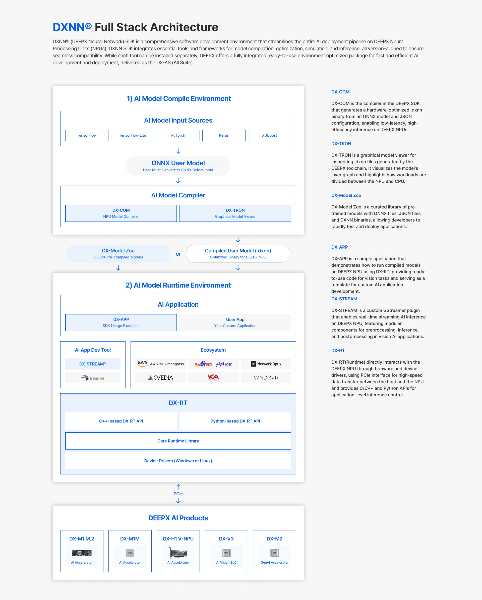

# Introduction

## Overview

**DX-AS (DEEPX All Suite)** is an integrated environment of frameworks and tools that enables inference and compilation of AI models using DEEPX devices. Users can build the integrated environment by installing individual tools, but DX-AS maintains optimal compatibility by aligning the versions of the individual tools.

### Components 

**DX-COM**

DEEPX NPU Compiler (DX-COM) produces the NPU Command Set from the provided ONNX and configuration file. The output file(graph.dxnn), which includes the generated command set and weights, is utilized for operating the NPU.

**DX-RT**

DX-RT is the DEEPX Runtime SDK for AI inference using DEEPX devices. It supports pre-built models from the DEEPX model zoo and models compiled by DXCOM (the DEEPX Compiler SDK).

DX-RT provides C/C++ APIs, allowing users to develop applications by calling these APIs.  It also offers a Python wrapper, enabling users to develop applications using Python scripts.

DX-RT includes command-line interface (CLI) commands for checking model information, running benchmarks with dummy files, and monitoring the status of the NPU.

DX-RT uses the DX NPU Driver to send input data to the NPU via the PCIe interface and receive the model inference results.

**DX-ModelZoo**

DEEPX aims to provide developers with an effortless experience using DeepX NPUs through DeepX Open Modelzoo, which offers a variety of neural network models supported by DeepX NPUs.

All featured models are provided with pre-trained ONNX models, configuration json files, and pre-compiled binaries named DXNN(DeepX Neural Network).

Developers can also compile featured ONNXs to DXNN, which enables rapid application development accelerated by DeepX NPUs. Comprehensive performance benchmark tools are available for comparing models of quantized INT8 on DeepX NPUs with full precision FP32 on GPUs or CPUs.

**DX-APP**

As an example of using the DX-RT API, the User Application Example allows users to easily set up the runtime environment and quickly see a demonstration. DX-APP enables rapid demonstrations of deep learning model inference for vision tasks such as object detection, face detection, and classification, utilizing the DEEPX NPU. Users can refer to the DX-APP code as a guide for developing their own applications.

**DX-Stream**

DX-Stream is a GStreamer Custom Plugin designed to simplify the development of Vision AI Applications using DEEPX's NPU in a GStreamer pipeline format. DX-Stream enables rapid and efficient development of Vision AI Applications by providing a modular, pipeline-based framework powered by DEEPX's NPU. The customizable preprocessing, inference, and postprocessing elements ensure flexibility for a variety of AI scenarios.

---

## DX-AS (DEEPX All Suite) Environments and Installation Guide

### [AI Model Compile Environment](https://github.com/DEEPX-AI/dx-compiler) (Compiler Platform)

**Purpose**  
  - Must be installed on the Host machine that will perform the compilation (converting) of ONNX models to our proprietary DXNN (DEEPX format).  

**Core Components**
  - DX-COM: Converts ONNX models into highly optimized, NPU-ready binaries.

**Flexibility & Support**
  - OS: Compatible with Debian-based Linux (Ubuntu 20.04, 22.04, 24.04)
  - Architecture: Supports x86_64 only

**Easy Installation**
  - Our single script automates the full setup process
  - All DX-Compiler components are ready to use upon completion.

**You can install dx-compiler by following the instructions at this [LINK](https://github.com/DEEPX-AI/dx-all-suite/blob/staging/docs/source/installation.md#local-installation).**

### [AI Model Runtime Environment](https://github.com/DEEPX-AI/dx-runtime) (Deployment Platform)

**Purpose**  
  - Must be installed on the Target system where the DEEPX M1 M.2 module is attached and the DEEPX AI model (.dxnn) will be executed.  

**Core Components**
  - DX-RT & DX-FW & NPU Driver: Foundational software for NPU control
  - DX-APP: C++ and Python examples to jump-start your projects
  - DX-Stream: GStreamer integration for seamless multimedia pipelines

**Flexibility & Support**
  - OS: Compatible with Debian-based Linux (Ubuntu 20.04, 22.04, 24.04)
  - Architecture: Supports both x86_64 and arm64

**Easy Installation**
  - Our script automates the entire process
  - One-time reboot is required after installation to finalize the NPU Driver setup

**You can install dx-runtime by following the instructions at this [LINK](https://github.com/DEEPX-AI/dx-all-suite/blob/staging/docs/source/installation.md#install-dx-runtime-environment).**

---

## Installation Guide
[Link](installation.md)

## Getting Started
[Link](getting-started.md)

## Version Compatibility
[Link](version_compatibility.md)

## FAQ
[Link](docs/source/faq.md)

---
