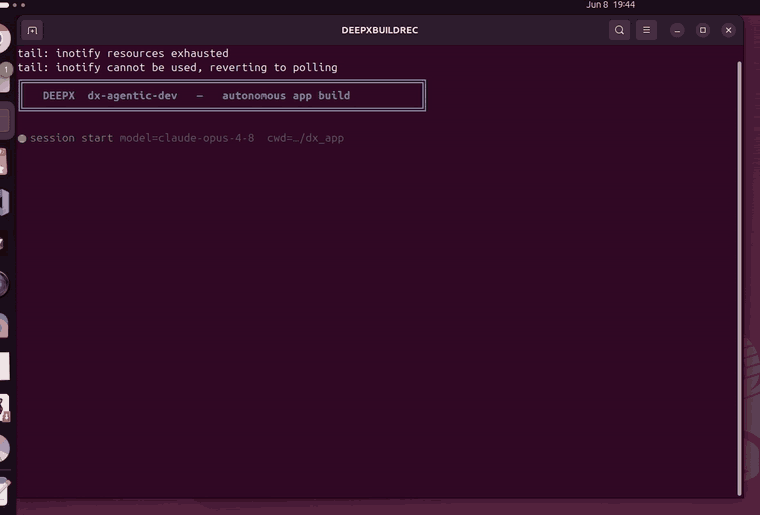

# 스쿼트 피트니스 미니게임 — dx-agent-dev로 제작

> **단일 자연어 프롬프트로 [dx-agent-dev](../../docs/source/00_Agent_Driven_Development_kor.md)가
> end-to-end로 생성** — 손으로 작성한 코드 없음. 이 폴더는 **self-contained & portable**입니다:
> 프레임워크를 `./common`으로 vendoring하므로 dx-all-suite 밖으로 복사해도 동작합니다
> (DEEPX 런타임이 있는 임의 머신).

<div align="center">
<table>
<tr>
<td align="center"><br><sub><b>dx-agent-dev가 앱을 빌드하는 모습 (timelapse)</b></sub></td>
<td align="center"><br><sub><b>생성된 앱이 DX-M1 NPU에서 실행되는 모습</b></sub></td>
</tr>
</table>
</div>

> **agent가 어떻게 만들었는지 보기:** [`claude-code-session.md`](./claude-code-session.md)
> (GitHub에서 렌더링됨; `claude-code-session.html`은 로컬 브라우저에서 열기).

### 이 앱이 만들어진 과정 — 세션 메트릭

빌드 세션 transcript(`claude-code-session.*`)에서 발췌:

| 항목 | 값 |
|------|-----|
| 코딩 에이전트 | **Claude Code** (`claude` CLI, headless `-p`) |
| 모델 | **Claude Opus 4.8** (`claude-opus-4-8`) |
| 사람 입력 | **자연어 프롬프트 1개** — 완전 자율, 손으로 작성한 코드 없음 |
| 빌드 wall-clock | **≈ 11.5분** |
| Agent turn 수 | **132** |
| 사용 도구 | `Bash` ×25, `Read` ×14, `Write` ×13, `Skill` ×5, `Edit` ×2 |
| 호출한 skill (순서) | `dx-skill-router` → `dx-agent-brainstorm` → `dx-swe-writing-plans` → `dx-agent-tdd` → `dx-agent-verify` |
| Output 토큰 | **≈ 109K** |
| 대략 비용 | **≈ $7.3** |

brainstorm → plan → TDD → verify 전체 skill 시퀀스가 앱 완료 선언 전에 end-to-end로
실행됐습니다 — transcript에 각 단계가 실제 tool call로 기록돼 있습니다.

아케이드 스타일 스쿼트 카운터. DEEPX NPU에서 **yolo26n-pose**를 실행해 신체 keypoint(무릎+엉덩이
각도)로 스쿼트 횟수를 검출하고, 실시간으로 횟수를 세며, 게임 HUD(횟수, depth bar,
**GOOD REP** 배너)를 오버레이합니다. **비디오 파일** 또는 **라이브 카메라**에서 동작합니다.
비디오 파일로 실행하면 **주석이 표시된 출력 영상**을 저장합니다.

## 프롬프트

> 에이전트에게 준 실제 자연어 프롬프트 (verbatim):

```
Build a squat-counting fitness mini-game using yolo26n-pose on DEEPX NPU, validate with dx-agent-dev-showcase/mini-game-squat-fitness/sample/squat_demo.mp4
```

> **이 프롬프트는 dx-all-suite root에서 실행하세요** — 샘플 영상 경로가 suite root 기준이며, DEEPX Agent-Driven Development 라우팅이 거기서 시작합니다.

## 빠른 시작

```bash
./setup.sh                          # 프레임워크를 ./common으로 vendoring, dx_engine bridge, deps 설치
./run.sh                            # 동봉 데모 영상으로 headless 검증 (annotated output 저장)
DISPLAY_MODE=1 ./run.sh             # 라이브 on-screen 창
VIDEO=/path/to/clip.mp4 ./run.sh    # 다른 비디오 사용
DXNN_MODEL=/path/to/yolo26n-pose.dxnn ./run.sh   # 명시적 모델 지정
```

`run.sh`는 모델을 자동으로 resolve합니다: 동봉된 `./yolo26n-pose.dxnn`를 우선 사용하고,
없으면 `$SUITE_ROOT/dx-runtime/dx_app/assets/models/`(및 `models-*/`)로 fallback합니다.
input은 기본적으로 동봉된 `sample/squat_demo.mp4`를 사용합니다.

직접 실행 (동등):

```bash
python yolo26n_pose_squat_sync.py --model yolo26n-pose.dxnn --video sample/squat_demo.mp4 --no-display --save
python yolo26n_pose_squat_sync.py --model yolo26n-pose.dxnn --camera 0 --display
```

## 런타임 옵션 (run.sh)

| 변수 | 의미 |
|------|------|
| `DISPLAY_MODE=1` | 라이브 on-screen 창 (기본값은 headless + annotated 영상 저장) |
| `VIDEO=<file>` | input으로 사용할 비디오 파일 지정 (기본: `sample/squat_demo.mp4`) |
| `DXNN_MODEL=<path>` | 사용할 `.dxnn` 모델 지정 (기본: 자동 resolve) |

display 창에서 **q** 또는 **ESC**로 종료.

## 스쿼트 검출 방식

- **무릎 각도** = 무릎에서 hip→knee와 ankle→knee 사이 interior 각도(COCO-17 인덱스: hip 11/12,
  knee 13/14, ankle 15/16). 양 다리가 보이면 좌+우 평균(`min_visible_legs` 설정 가능).
- 2-state hysteresis FSM(`SquatCounter`)이 DOWN→UP 한 사이클당 1회 카운트하며,
  `squat_angle`(down)과 `stand_angle`(up)로 게이트합니다. 기본값(`squat_angle=140`,
  `stand_angle=160`)은 샘플 클립의 front-facing 카메라에 맞춰졌습니다 — 2D-projected
  무릎 각도가 교과서적 90°가 아니라 ~126–179°로 읽히기 때문입니다. side-view처럼 bend가
  더 깊게 읽히는 setup에서는 `config.json`의 threshold를 조정하세요.

## 아키텍처 (IFactory + SyncRunner, skeleton-first)

| 구성요소 | 구현 |
|----------|------|
| Preprocessor | `LetterboxPreprocessor` (framework) |
| Postprocessor | `YOLOv8PosePostprocessor` (framework) → COCO-17 포함 `PoseResult` |
| Visualizer | **`SquatGameVisualizer`** — stateful rep FSM + 아케이드 HUD |
| Factory | **`SquatGameFactory`** (`IPoseFactory`, 5 메서드 + `get_num_keypoints`) |
| Runner | `SyncRunner` (단일 모델, frame-ordered) |

게임 로직은 전부 visualizer의 `visualize(frame, results)` hook 안에 있습니다 — 직접적인
`InferenceEngine` 호출 없이 프레임워크 패턴을 완전히 따릅니다. 순수 geometry + FSM
(`compute_angle`, `SquatCounter`)은 hardware 없이 unit-test 가능하도록 `squat_logic.py`에
분리돼 있습니다.

## 파일

| 파일 | 용도 |
|------|------|
| `yolo26n_pose_squat_sync.py` | 진입점 — factory 생성, `SyncRunner` 실행 |
| `factory/squat_game_factory.py` | `SquatGameFactory` (IFactory) |
| `factory/squat_game_visualizer.py` | `SquatGameVisualizer` (게임 hook + HUD) |
| `factory/squat_logic.py` | 순수 `compute_angle` + `SquatCounter` FSM |
| `factory/__init__.py` | factory export |
| `config.json` | 검출 + `squat_game` threshold (target reps, 각도) |
| `test_squat_logic.py` | angle 수학 + FSM unit test (10개) |
| `setup.sh` / `run.sh` | self-contained 셋업 + relocatable 런처 |
| `session.json` / `session.log` | 세션 메타데이터 + 명령 로그 |

## Self-contained / portable

`setup.sh`가 공용 프레임워크를 `./common`으로 vendoring하고 dx-runtime venv에서 `dx_engine`을
bridge합니다. entry walker는 그 vendored `./common`을 우선 사용합니다(`PYTHONPATH` 불필요).
샘플 동봉 + 모델 자동 resolve로, 폴더를 dx-all-suite 밖으로 복사해도 동작합니다 —
`dx_engine`(DEEPX 런타임)이 유일한 외부 전제입니다.
</content>
