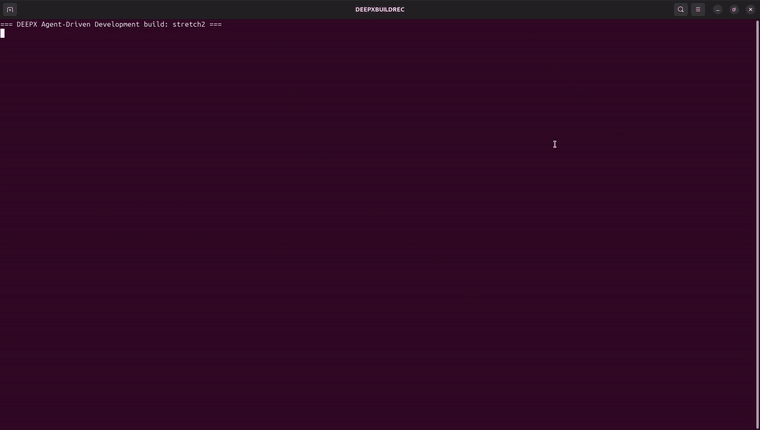

# Stretch Coach — 아케이드 스트레칭 미니게임 (yolo26n-pose · DX-M1 NPU)

> **스토리.** 단일 자연어 프롬프트로 dx-agent-dev가 온디바이스 **아케이드 스트레칭 게임**을
> 만듭니다: `yolo26n-pose` COCO-17 keypoint를 DEEPX **DX-M1 NPU**에서 실행해, **3가지 스트레칭**
> (머리 위로 뻗기 → 앞으로 굽히기 → 목 스트레칭)을 HOLD-투-어드밴스 루프 + GOOD!/CLEAR!
> 피드백으로 안내합니다.
>
> 좌상단 **코치 아바타** — 채워진, 사람 같은 휴머노이드(원형 머리, 채워진 몸통/골반, 음영
> 처리된 관절의 테이퍼드 limb capsule) — 가 각 목표 스트레칭을 시연하며, 중립 자세와 목표
> pose 사이를 부드럽게 반복해 플레이어가 따라 할 수 있게 합니다.

<div align="center"><table><tr>
<td align="center"><br><sub><b>게임플레이 — 채워진 휴머노이드 코치(좌상단) + 실시간 NPU pose 추적</b></sub></td>
<td align="center"><br><sub><b>dx-agent-dev가 빌드하는 과정 (타임랩스)</b></sub></td>
</tr></table></div>

> **에이전트가 어떻게 만들었는지 보기:** [`claude-code-session.md`](./claude-code-session.md).

### Session 메트릭

| 항목 | 값 |
|--------|-------|
| Coding agent / model | **Claude Code** / **Claude Opus 4.8** (`claude-opus-4-8`) |
| 사람 입력 | **자연어 프롬프트 1개** — 완전 자율 |
| Skills | `dx-skill-router` → `dx-agent-brainstorm` → `dx-swe-writing-plans` → `dx-agent-tdd` → `dx-agent-verify` |
| Build wall-clock / turns | ≈ 15.3분 / 130 |
| Output tokens / 대략 비용 | ≈ 142K / ≈ $8.1 |
| Tools | `Bash`×27, `Read`×17, `Write`×12, `Skill`×5, `Edit`×2 |

## 프롬프트

프롬프트(아래 원문)는 코치 아바타를 pose keypoint로부터 **채워진 절차적 휴머노이드**로
그리도록 요구합니다:

```
Using the yolo26n-pose model on the DEEPX NPU, build a simple arcade-style stretching mini-game. The game guides the user through three stretch poses, one stage at a time: (1) extend both arms straight overhead, (2) bend forward at the waist (forward fold), and (3) pull the head to one side with one hand for a neck stretch.

For each stage, render a small coach avatar in a top-left panel that demonstrates the current target stretch. IMPORTANT — the coach must look like a REAL PERSON, not a stick figure: draw it as a FILLED, PROCEDURAL HUMANOID built from the pose keypoints — a round head, a filled torso/pelvis body, and tapered LIMB CAPSULES (filled rounded segments for upper-arm/forearm and thigh/shin) with smooth filled joints, shaded so it reads as a human body silhouette. Do NOT draw it as thin stick-figure lines or a bare keypoint skeleton. Animate the coach so it feels alive — cycle smoothly between a neutral standing pose and the full target stretch pose (a looped demonstration). Show the stretch name and a short text instruction next to the coach.

Recognize each pose from the player's body keypoints (wrists above the head for the overhead reach; torso folded forward with shoulders dropped toward hips for the waist bend; one hand raised beside the head for the neck stretch). When the user holds the matching pose briefly, advance to the next stage; clear the game when all three are done.

Overlay an arcade-style UI on each frame: STAGE n/3, the animated humanoid coach avatar, the target stretch name + instruction, a HOLD progress indicator, and GOOD! / CLEAR! feedback. The generated app must support both a video-file input and a live camera input, selectable at runtime (e.g. --video <file> or --camera <id>). Implement and validate it using the provided demo video at dx-agent-dev-showcase/mini-game-stretching-coach/sample/stretching_demo.mp4, which contains a person performing the three stretches in sequence; derive the coach target-pose shapes as needed (procedurally or from representative frames of that video). When run on a video file, save an annotated output video so the result can be reviewed.

Work autonomously to completion without asking for confirmation or approval; make default decisions per the knowledge base and PRODUCE THE ACTUAL ARTIFACTS (runnable app + setup.sh + run.sh, validated headless --no-display --save on the demo video). Respond in English.
```

> **이 프롬프트는 dx-all-suite root에서 실행하세요** — 샘플 영상 경로가 suite root 기준이며, DEEPX Agent-Driven Development 라우팅이 거기서 시작합니다.

## 게임

| Stage | 스트레칭 | keypoint 인식 |
|------:|---------|---------------------------|
| 1/3 | **OVERHEAD REACH** | 양 손목이 머리 위로 |
| 2/3 | **FORWARD FOLD** | 머리/어깨가 골반 쪽으로 내려감(상체 앞으로 굽힘) |
| 3/3 | **NECK STRETCH** | 한 손을 머리 옆으로 올리고 다른 팔은 아래 |

해당 pose를 ~1.2초 유지 → **GOOD!** + 다음 단계; 3개 모두 완료 → **CLEAR!**
화면: STAGE n/3, 애니메이션 **휴머노이드 코치**(좌상단), 스트레칭 이름 + 안내, HOLD 진행 바,
플레이어 실시간 skeleton, model · NPU · FPS 상태줄.
인식은 **scale-invariant** — 모든 임계값이 플레이어의 어깨 너비로 정규화되어, 카메라와의
거리에 관계없이 동작합니다.

## 아키텍처

표준 dx_app pose 파이프라인 — `StretchGameFactory`(`IPoseFactory`, `LetterboxPreprocessor`
+ `YOLOv8PosePostprocessor` 재사용) + `SyncRunner`. 엔트리(`yolo26n_pose_sync.py`)는 factory를
`SyncRunner`에 연결만 하고, 모든 게임 로직은 visualizer에 있습니다. `stretch_coach.py`의
`StretchCoachVisualizer`가 per-frame 상태머신, pose 인식기, 채워진 휴머노이드 코치 렌더러
(`cv2.fillConvexPoly` 몸통 + 테이퍼드 limb capsule), 아케이드 HUD를 담당합니다.

## 재현

```bash
bash setup.sh        # venv(dx-runtime) + GUI OpenCV + framework vendoring
bash run.sh          # 번들 데모 비디오 실행 → annotated output/<run>/output.mp4
bash run.sh --camera 0          # 라이브 카메라 (디스플레이 필요)
bash run.sh --video clip.mp4    # 임의 비디오
```

인자 없이 `run.sh`를 실행하면 번들 `sample/stretching_demo.mp4`를 headless로 재생하고
`output/<run>/`에 annotated mp4를 저장합니다. 전달한 인자는 그대로 앱으로 전달됩니다
(예: `--camera 0`, `--video path.mp4`). 모델은 `DXNN_MODEL=/path/yolo26n-pose.dxnn bash run.sh`로
override할 수 있습니다.

> x86-64 Linux + DeepX DX-M1 runtime(`yolo26n-pose.dxnn`) 필요. self-contained: `common/`이
> vendoring되고 `sample/stretching_demo.mp4`가 번들 → suite 밖으로 옮겨도 실행됨.

## 파일

| 파일 | 용도 |
|------|---------|
| `yolo26n_pose_sync.py` | 엔트리 — `StretchGameFactory` + `SyncRunner` (standalone import walker) |
| `stretch_coach.py` | `StretchCoachVisualizer` — pose 인식기, **채워진 휴머노이드 코치 렌더러**, `StretchGame` 상태머신 + 아케이드 HUD |
| `factory/` | `IPoseFactory` base + `StretchGameFactory`(Letterbox + YOLOv8Pose) |
| `common/` | vendoring된 dx_app framework (runner, processors, base, …) |
| `config.json` | pose 임계값 + hold 타이밍(데모에서 calibrate) |
| `test_recognizers.py` | unit test — 각 stage 인식기가 올바른 pose에서 동작하는지 assert |
| `setup.sh` / `run.sh` | relocatable 셋업 / 원커맨드 런처 |
| `sample/stretching_demo.mp4` | 번들 데모 입력 |
| `session.json` / `session.log` | 빌드 메타데이터 / 실제 명령 출력 로그 |
| `claude-code-session.md` | 전체 에이전트 빌드 transcript |

영어: [`README.md`](./README.md).
