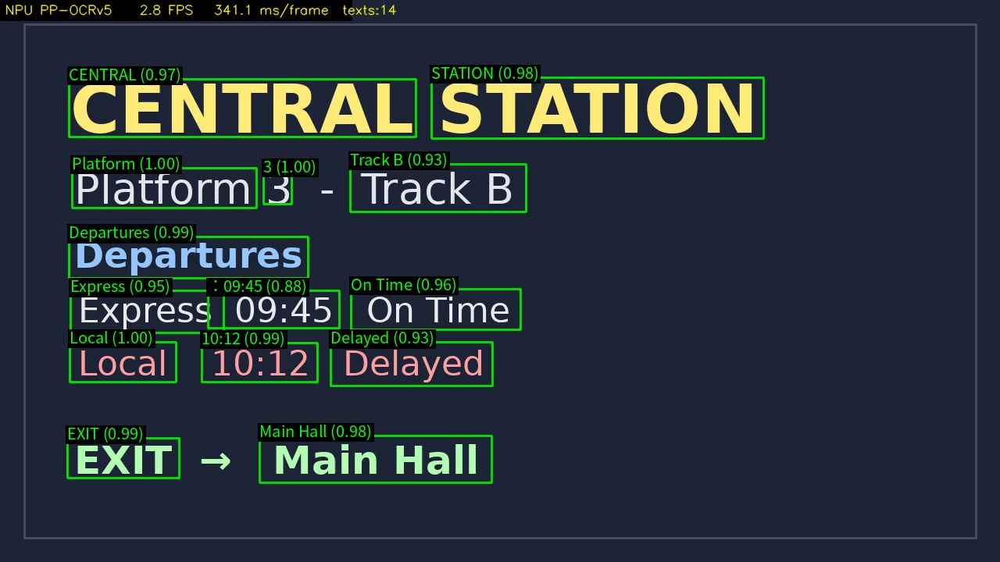

# DEEPX DX-M1 NPU에서 Video / Webcam OCR (PaddleOCR · PP-OCRv5)

> **스토리.** toolset·파일·repo 브랜치를 적지 않은 **짧은 자연어 프롬프트** 하나로 dx-agent-dev가
> DEEPX **DX-M1 NPU** 실시간 **OCR 앱**을 만듭니다: PaddleOCR **PP-OCRv5**(detection → textline
> 방향 → recognition)를 NPU에서 실행해 매 프레임의 텍스트 박스 + 인식 문자열을 오버레이합니다.
> 단일 코드 경로가 **비디오 파일과 라이브 웹캠 둘 다**(`--source <path.mp4>` / `--source
> <camera_index>`) 받아 annotated 출력 영상을 저장합니다.

<div align="center"><table><tr>
<td align="center"><br><sub><b>프레임별 NPU OCR — 박스 + 인식 문자열 + 신뢰도</b></sub></td>
<td align="center"><br><sub><b>dx-agent-dev가 빌드하는 과정 (타임랩스)</b></sub></td>
</tr></table></div>

<div align="center"><br><sub><b>annotated 샘플 프레임 — PP-OCRv5 det+cls+rec on DX-M1 NPU</b></sub></div>

> **에이전트가 어떻게 만들었는지 보기:** [`claude-code-session.md`](./claude-code-session.md).

### Session 메트릭

| 항목 | 값 |
|--------|-------|
| Coding agent / model | **Claude Code** / **Claude Opus 4.8** (`claude-opus-4-8`) |
| 사람 입력 | **짧은 자연어 프롬프트 1개** — 완전 자율 |
| 읽은 KB toolset | `paddleocr-rapiddoc-app`, `paddlepaddle-deepx` — 프롬프트에 적지 않았으나 **routing으로 스스로 찾음** |
| Skills | `dx-skill-router` → `dx-agent-brainstorm` → … → `dx-agent-verify` |
| Wall-clock / turns / cost | ~18분 / 175 / ≈ $12.0 |

## 프롬프트

짧고 목표만 담음 — toolset 경로·브랜치를 적지 않고(입력 영상만 명시), 그 부분(과 포크 파이프라인
위에 자체 앱을 생성하는 결정)은 skill + KB routing이 채웁니다:

```
Build an OCR inference app whose text detection + recognition runs on the DEEPX DX-M1 NPU.
The app must accept BOTH a video file (--source <path.mp4>) and a live webcam
(--source <camera_index>), run NPU OCR on each frame, overlay the detected text boxes and
the recognized strings, and write an annotated output video (optionally show a live
window). Save one annotated sample frame as sample_detect.jpg. Validate it on the provided
demo video at dx-agent-dev-showcase/paddleocr-video-ocr/sample/ocr_demo.mp4. Provide
setup.sh, run.sh, and a short README reporting the measured per-frame latency / FPS on the NPU.
```

> **이 프롬프트는 dx-all-suite root에서 실행하세요** — 샘플 영상 경로가 suite root 기준이며, DEEPX Agent-Driven Development 라우팅이 거기서 시작합니다.

> **아키텍처 노트.** **PaddleOCR-deepx**(`deepx` 브랜치) 기반. OCR은 det→cls→rec 다단계
> 파이프라인(단일 `.dxnn`/dx_app registry 없음)이라 IFactory / SyncRunner 패턴의 문서화된
> **예외**입니다: `ocr_video.py`는 포크의 vendored `engine/` 파이프라인을 라이브러리로 구동하는
> **자체 standalone entry**이며, 포크 demo를 shell-out하지 않습니다.

## 측정된 NPU 성능

이번 session의 번들 데모(`sample/ocr_demo.mp4`) 실행 실측, DX-M1(runtime 3.3.2 / FW v2.5.6),
HUD + `session.log` 기록:

- **PP-OCRv5 NPU: ~2.8 FPS, ~341 ms/frame**, 프레임당 텍스트 region 14개 (det+cls+rec).
- detection은 ratio 버킷 모델(det_v5_640/960), recognition은 width-ratio 모델
  (rec_v5_ratio_3/5/10/15/35) — 모두 DX-M1 NPU.
- `--frame-skip N`은 NPU 실행 사이 마지막 결과를 재사용해 라이브 웹캠을 매끄럽게 유지.

## 빠른 시작

```bash
./setup.sh                       # venv + shapely/pyclipper + dx_engine bridge + NPU 모델 다운로드
./run.sh                         # 번들 데모 영상 OCR → ocr_output.mp4 + sample_detect.jpg
./run.sh myclip.mp4 out.mp4      # 비디오 파일 OCR
./run.sh 0 webcam_out.mp4 --show # 라이브 웹캠(카메라 0) + 미리보기 창
```

> x86-64 Linux + DeepX DX-M1 runtime 필요. self-contained: 포크의 `engine/` 파이프라인이
> vendoring되고 `sample/ocr_demo.mp4`가 번들됨; `setup.sh`가 deps 설치 + PP-OCRv5 NPU 모델 다운로드
> (`fork_setup_models.sh` → `engine/model_files/`, 커밋 안 함). CJK 렌더는 선택적 Noto/sim 폰트 사용,
> 없으면 ASCII 텍스트로 fallback.

## 파일

| 파일 | 용도 |
|------|---------|
| `ocr_video.py` | **자체** standalone entry — `open_source`(비디오 **또는** 웹캠) → NPU OCR → overlay |
| `engine/` | vendored PaddleOCR-deepx 파이프라인(PP-OCRv5 det/cls/rec; `model_files/`는 setup이 다운로드) |
| `fork_setup_models.sh` | PP-OCRv5 `.dxnn` 모델을 `engine/model_files/`로 다운로드 |
| `setup.sh` / `run.sh` | relocatable 셋업 / 원커맨드 런처(기본=번들 데모) |
| `verify.py` | headless 검증(NPU 검출 assert + annotated 출력 저장) |
| `sample/ocr_demo.mp4` | 번들 데모 입력(텍스트 장면: 역 안내판/카페 메뉴/라벨/공지) |
| `sample_detect.jpg` | annotated 샘플 프레임 |
| `claude-code-session.md` | 전체 에이전트 빌드 transcript (Wall-clock + Cost) |

영어: [`README.md`](./README.md).
