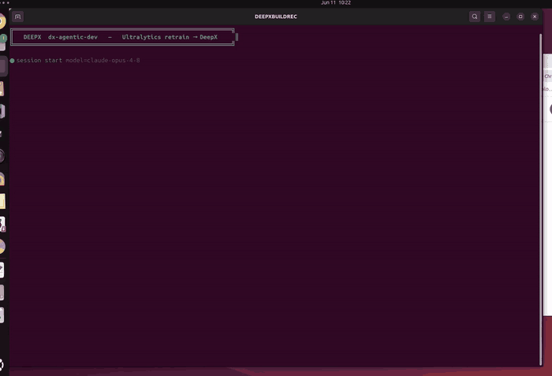
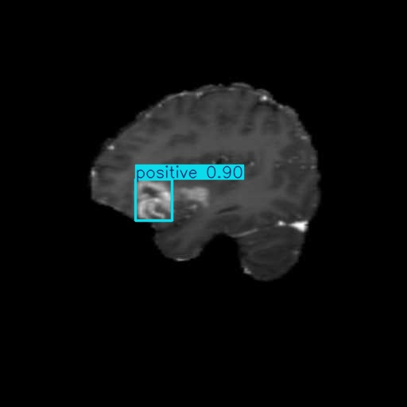

# 뇌종양 스크리닝 — YOLO26n Domain Retrain → DeepX NPU

> **스토리.** `yolo26n`은 **COCO 사전학습**이라 의료 클래스가 없어 MRI/CT 종양을 스크리닝 못 합니다. 이 showcase는 **의료 edge 디바이스**용으로 적응시킵니다: `brain-tumor`로 fine-tune하고 stock·재학습을 DeepX **DX-M1 NPU**(`format=deepx`, INT8)로 export해 네 형태 전부 정확도(mAP)+속도(FPS)를 측정.

<div align="center"><table><tr>
<td align="center"><br><sub><b>dx-agent-dev가 이 showcase를 만드는 과정 (timelapse)</b></sub></td>
<td align="center"><br><sub><b>재학습 모델의 종양 검출 (DX-M1 NPU)</b></sub></td>
</tr></table></div>

> **에이전트가 만든 과정:** [`claude-code-session.md`](./claude-code-session.md).

### 세션 메트릭

| 항목 | 값 |
|--------|-------|
| Coding agent / model | **Claude Code** / **Claude Opus 4.8** (`claude-opus-4-8`) |
| 사람 입력 | **자연어 프롬프트 1개** — 완전 자율 |
| 읽은 KB toolset | `ultralytics-train-eval`, `ultralytics-deepx-export` |
| 사용 skill | `dx-skill-router` → `dx-agent-brainstorm` → `dx-swe-writing-plans` → `dx-agent-tdd` → `dx-agent-verify` |

## 프롬프트

```
Using the Ultralytics Python package, adapt the base yolo26n model for a medical edge device that screens MRI/CT brain scans for tumors. The stock yolo26n is a general COCO-trained detector that does not recognize brain tumors, so fine-tune (retrain) it on the Ultralytics brain-tumor dataset (classes: negative, positive) on the local GPU for about 40 epochs to produce a domain-optimized tumor-detection model. Then evaluate accuracy (mAP50-95) and speed (FPS) for BOTH the base model and the retrained model in two forms each: (a) the PyTorch model in fp32 on the GPU, and (b) its DeepX export (.dxnn, INT8 on the DX-M1 NPU, via format=deepx). Write report.md comparing all four results (base vs retrained, fp32 vs INT8) with a short analysis of the accuracy gain and the INT8 quantization effect. Work autonomously to completion without asking for confirmation or approval; make default decisions per the knowledge base and PRODUCE THE ACTUAL ARTIFACTS (both .dxnn model dirs, the measured FPS/mAP numbers, report.md), not just a plan.
```

## 결과 (실측)

`brain-tumor` val split, `imgsz=640`. base = stock COCO `yolo26n`; retrained = 40-epoch fine-tune (`nc=2`).

| Model | Form | Device | mAP50-95 | mAP50 | FPS |
|---|---|---|---:|---:|---:|
| base `yolo26n` | `.pt` fp32 | GPU | 0.0005 | 0.0010 | 529.3 |
| base `yolo26n` | `.dxnn` INT8 | DX-M1 NPU | 0.0004 | 0.0011 | 59.0 |
| retrained | `.pt` fp32 | GPU | 0.4068 | 0.5589 | 582.2 |
| **retrained** | **`.dxnn` INT8** | **DX-M1 NPU** | **0.3980** | **0.5441** | **83.4** |

- **도메인 재학습**: mAP50-95 **~0.0005 → 0.40**. **INT8 ≈ fp32**(0.4068 vs 0.3980). **NPU에서 더 빠름**: 59 → **83.4 FPS**(nc=2 vs nc=80).

전체 표·분석: [`report.md`](./report.md). 배포 대상 = row 4; 위 샘플은 재학습 모델 실제 NPU 검출.

## 재현

```bash
bash setup.sh
bash run.sh          # acquire → baseline export → retrain → improved export → 4-way eval → report + sample
```

> x86-64 Linux + DeepX runtime; `dx_engine` 없으면: `cd dx-runtime && bash install.sh --all --exclude-app --exclude-stream`.

English: [`README.md`](./README.md).
