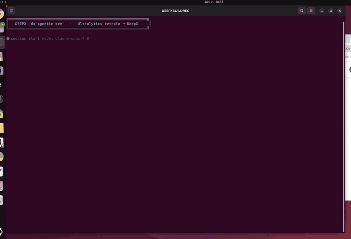

# Pharmaceutical Pill Inspection — YOLO26n Domain Retrain → DeepX NPU

> **The story.** `yolo26n` is **COCO-pretrained** — it knows "person", "car", "dog", but not pharmaceutical pills. This showcase adapts it for a **pharma inspection / counting edge device**: fine-tune on the Ultralytics `medical-pills` dataset, export stock + retrained to the DeepX **DX-M1 NPU** (`format=deepx`, INT8), and measure accuracy (mAP) + speed (FPS) across all four model forms.

<div align="center"><table><tr>
<td align="center"><br><sub><b>dx-agent-dev building this showcase (timelapse)</b></sub></td>
<td align="center"><br><sub><b>retrained model detecting pills (DX-M1 NPU)</b></sub></td>
</tr></table></div>

> **See how the agent built it:** [`claude-code-session.md`](./claude-code-session.md).

### Session metrics

| Metric | Value |
|--------|-------|
| Coding agent / model | **Claude Code** / **Claude Opus 4.8** (`claude-opus-4-8`) |
| Human input | **1 natural-language prompt** — fully autonomous |
| KB toolsets read | `ultralytics-train-eval`, `ultralytics-deepx-export` |
| Skills | `dx-skill-router` → `dx-agent-brainstorm` → `dx-swe-writing-plans` → `dx-agent-tdd` → `dx-agent-verify` |

## The prompt

```
Using the Ultralytics Python package, adapt the base yolo26n model for a pharmaceutical pill identification/counting station. The stock yolo26n is a general COCO-trained detector that does not recognize medical pills as a dedicated class, so fine-tune (retrain) it on the Ultralytics medical-pills dataset (class: pill) on the local GPU for about 40 epochs to produce a domain-optimized pill-detection model. Then evaluate accuracy (mAP50-95) and speed (FPS) for BOTH the base model and the retrained model in two forms each: (a) the PyTorch model in fp32 on the GPU, and (b) its DeepX export (.dxnn, INT8 on the DX-M1 NPU, via format=deepx). Write report.md comparing all four results (base vs retrained, fp32 vs INT8) with a short analysis of the accuracy gain and the INT8 quantization effect. Work autonomously to completion without asking for confirmation or approval; make default decisions per the knowledge base and PRODUCE THE ACTUAL ARTIFACTS (both .dxnn model dirs, the measured FPS/mAP numbers, report.md), not just a plan. Before writing any code, READ the dx-compiler knowledge base toolsets dx-compiler/.deepx/toolsets/ultralytics-train-eval.md and dx-compiler/.deepx/toolsets/ultralytics-deepx-export.md and follow them. Also, after evaluation, save an annotated detection SAMPLE IMAGE — the retrained model run on a representative validation image with bounding boxes + class labels drawn — as sample_detect.jpg in the session directory. Respond in English.
```

## Results (real, measured)

`medical-pills` val split, `imgsz=640`. base = stock COCO `yolo26n`; retrained = 40-epoch fine-tune.

| Model | Form | Device | mAP50-95 | mAP50 | FPS |
|---|---|---|---:|---:|---:|
| base `yolo26n` | `.pt` fp32 | GPU | 0.0010 | 0.0041 | 118.6 |
| base `yolo26n` | `.dxnn` INT8 | DX-M1 NPU | 0.0083 | 0.0195 | 55.1 |
| retrained | `.pt` fp32 | GPU | 0.7583 | 0.9698 | 986.8 |
| **retrained** | **`.dxnn` INT8** | **DX-M1 NPU** | **0.7484** | **0.9690** | **78.2** |

- **Domain retraining**: mAP50-95 **~0.001 → 0.75**, mAP50 **0.97**. **INT8 ≈ fp32** (0.7583 vs 0.7484). **Faster on NPU**: 55 → **78.2 FPS** (small pill head vs nc=80).

Full table + analysis: [`report.md`](./report.md). Deployable = row 4; sample above is the retrained model's real NPU detections.

## Reproduce

```bash
bash setup.sh
bash run.sh          # acquire → baseline export → retrain → improved export → 4-way eval → report + sample
```

> x86-64 Linux + DeepX runtime; `dx_engine` missing: `cd dx-runtime && bash install.sh --all --exclude-app --exclude-stream`.

Korean: [`README-ko.md`](./README-ko.md).
