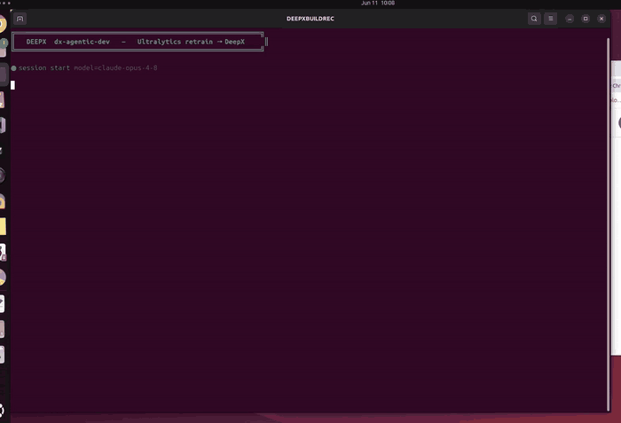
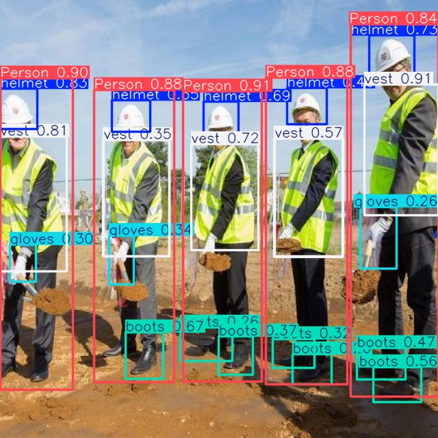

# Construction-PPE Detection — YOLO26n Domain Retrain → DeepX NPU

> **The story.** `yolo26n` ships **COCO-pretrained** — a *general* 80-class detector
> that has **never seen** construction safety gear, so it can't tell if a worker wears a
> helmet or vest. This showcase adapts it for a **construction / factory site-safety
> camera** (PPE compliance): fine-tune `yolo26n` on the Ultralytics `construction-ppe`
> dataset, export stock + retrained to the DeepX **DX-M1 NPU** (`format=deepx`, INT8),
> and measure **accuracy (mAP) + speed (FPS)** across all four model forms.

<div align="center"><table><tr>
<td align="center"><br><sub><b>dx-agent-dev building this showcase (timelapse)</b></sub></td>
<td align="center"><br><sub><b>retrained model detecting PPE (DX-M1 NPU)</b></sub></td>
</tr></table></div>

> **See how the agent built it:** [`claude-code-session.md`](./claude-code-session.md).

### Session metrics

| Metric | Value |
|--------|-------|
| Coding agent / model | **Claude Code** (`claude` CLI) / **Claude Opus 4.8** (`claude-opus-4-8`) |
| Build wall-clock | **≈ 17.4 min** |
| Agent turns | **102** |
| Output tokens | **≈ 93K** |
| Approx. cost | **≈ $4.0** |
| Tools | `Bash`×18, `Read`×13, `Write`×8, `Skill`×5 |
| Human input | **1 natural-language prompt** — fully autonomous |
| KB toolsets read | `ultralytics-train-eval` |
| Skills used | `dx-skill-router` → `dx-agent-brainstorm` → `dx-swe-writing-plans` → `dx-agent-tdd` → `dx-agent-verify` |

## The prompt

```
Using the Ultralytics Python package, adapt the base yolo26n model for a construction/factory site-safety camera that checks PPE (personal protective equipment) compliance. The stock yolo26n is a general COCO-trained detector that does not recognize construction PPE items, so fine-tune (retrain) it on the Ultralytics construction-ppe dataset (classes: helmet, gloves, vest, boots, goggles) on the local GPU for about 40 epochs to produce a domain-optimized PPE-detection model. Then evaluate accuracy (mAP50-95) and speed (FPS) for BOTH the base model and the retrained model in two forms each: (a) the PyTorch model in fp32 on the GPU, and (b) its DeepX export (.dxnn, INT8 on the DX-M1 NPU, via format=deepx). Write report.md comparing all four results (base vs retrained, fp32 vs INT8) with a short analysis of the accuracy gain and the INT8 quantization effect. Work autonomously to completion without asking for confirmation or approval; make default decisions per the knowledge base and PRODUCE THE ACTUAL ARTIFACTS (both .dxnn model dirs, the measured FPS/mAP numbers, report.md), not just a plan.
```

## Results (real, measured)

`construction-ppe` val split, `imgsz=640`. base = stock COCO `yolo26n`; retrained = fine-tuned 40 epochs.

| Model | Form | Device | mAP50-95 | mAP50 | FPS |
|---|---|---|---:|---:|---:|
| base `yolo26n` | `.pt` fp32 | GPU | 0.0001 | 0.0008 | 219.4 |
| base `yolo26n` | `.dxnn` INT8 | DX-M1 NPU | 0.0001 | 0.0005 | 46.5 |
| retrained | `.pt` fp32 | GPU | 0.2519 | 0.4892 | 336.3 |
| **retrained** | **`.dxnn` INT8** | **DX-M1 NPU** | **0.2533** | **0.5058** | **62.3** |

- **Domain retraining**: mAP50-95 **0.0001 → ~0.25** (stock can't detect PPE at all).
- **INT8 ≈ fp32**: retrained fp32 0.2519 vs DX-M1 INT8 0.2533 — DeepX EMA calibration lossless here.
- **Domain model faster on the NPU**: 46.5 → **62.3 FPS** (1.34×; smaller effective head than stock nc=80).

Full table + analysis: [`report.md`](./report.md). Deployable = row 4. The sample image
above is `sample_detect.jpg` (retrained model, real NPU detections).

## Files

| File | What it is |
|---|---|
| `pipeline.py` | Single self-contained train → export → 4-way eval → sample pipeline (HERE-relative paths, regenerate-if-missing) |
| `make_report.py` | Renders `report.md` from `results.json` |
| `run.sh` | One-command launcher (uses the interpreter from `setup.sh`, tees to `session.log`) |
| `setup.sh` | Resolves/verifies the dx_rt venv (ultralytics + dx_engine + dx_com) |
| `verify.py` | Sanity-checks the produced artifacts |
| `report.md` | 4-way comparison table + analysis |
| `results.json` | Raw measured mAP/FPS (incl. per-class mAP) |
| `sample_detect.jpg` | Annotated retrained-model detection on a val image (real NPU) |

The build is **self-contained / relocatable**: a single `pipeline.py` resolves every path
against its own directory (`HERE = Path(__file__).resolve().parent`) and regenerates any
missing weights/exports — no absolute build-session paths are baked in. Binaries (`*.pt`,
`*.onnx`, `*_deepx_model/`, `runs/`) are regenerated, not committed.

## Reproduce

```bash
bash setup.sh        # verify the dx_rt venv (ultralytics + dx_engine + dx_com)
bash run.sh          # acquire → export baseline → retrain → export improved → 4-way eval → report + sample
```

> x86-64 Linux + DeepX runtime; if `dx_engine` missing: `cd dx-runtime && bash install.sh --all --exclude-app --exclude-stream`.

Korean: [`README-ko.md`](./README-ko.md).
