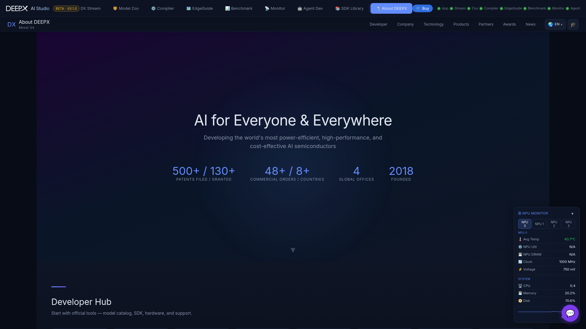

# The Hub

The **hub** is the landing page that ties the studio together. Every tool is launched
from here; you normally reach each one through the hub, which proxies them under a single
address.

## Layout

- **Orbital launcher** — the nine tools orbit the central DEEPX mark. Click a tile to
  open that tool; the shell swaps to the module while the hub chrome stays in place.
- **Live status** — a status dot on each tile (and the top-bar row) shows whether that
  module is online; the hub polls health every few seconds and flags a module that's
  starting, unavailable, or crashed. Each tile also shows the module's `:port`, which you
  can click to open that module directly in a new tab.
- **Top bar** — 6-language switcher, the guided-tutorial toggle, a **Platform Info**
  overview, and a shortcut to the DEEPX store / "Buy now".
- **Global AI assistant** — a floating help button (bottom-right) opens **DX AI Studio
  Help**, an assistant available across the whole studio; set or clear its API key from
  the panel. It supports multiple providers, including fully offline options (a local
  server or a signed-in coding CLI) — see
  [SDK Library & About](11_SDK_Library_and_About.md) for the full provider list.
- **Hub views** — besides the nine tools, the hub hosts the **SDK Library** (in-app
  DEEPX documentation and brochures) and the **About DEEPX** page. See
  [SDK Library & About](11_SDK_Library_and_About.md).

If a module fails to start, its tile shows an **unavailable / crashed** state with a
**Retry** action. The intro animation can be replayed any time via **Replay Intro**.

## Guided tutorial

**Tutorial Mode** is on by default: opening a module starts an interactive, step-through
walkthrough (coach marks with **Prev / Skip / Next**). Toggle it from the top bar to turn
the automatic tutorials off — or on — at any time.

## Navigating

- Click any orbital tile to enter a tool; use the top navigation or the browser **Back**
  button to return to the hub.
- The current tool and its view are reflected in the **URL**, so links are shareable and
  reload-safe (for example, a DX EdgeGuide recommendation or an SDK Library document can
  be linked directly).
- **Keyboard shortcuts** — `Alt`+`1`…`9` jump straight to a tool; `Esc` backs out of a
  tool or closes an open panel.

## Language

The entire studio is available in **6 languages** — English, 한국어, 日本語, 简体中文,
繁體中文, Español. Switch from the top bar at any time; the choice persists.

## Guided tutorials

Several tools ship an in-app guided tutorial. Toggle tutorial mode from the top bar to
get step-by-step callouts over the live UI. Tutorials are optional and can be replayed.
