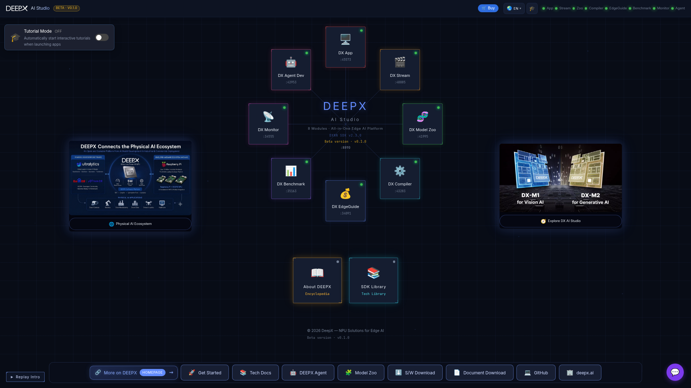

# DX Stream

Build and run real-time GStreamer vision-AI pipelines on the DEEPX NPU from your browser,
with live WebRTC playback.  

  

## Pages

- **Setup** — one-click guided install of everything a pipeline needs (runtime deps, NPU
  driver, the DX GStreamer plugin build, sample models/videos, WebRTC deps, GstShark). Run
  a single component or **Run All**; an environment-check table shows what's ready.  
- **Dashboard** — module status, quick-launch demo cards, and live FPS / latency / NPU-util
  metrics with sparklines.  
- **Demo** — start a preset pipeline by category (object / face detection, pose,
  multi-stream, RTSP, …); the processed video plays live (WebRTC) with an optional
  FPS/latency overlay and a collapsible GstShark performance panel. Stop or switch anytime.  
- **Pipeline Builder** — a drag-and-drop GStreamer editor: pick elements from a searchable
  palette, wire them on the canvas, edit properties, then Run/Stop with live playback.
  Save / load named pipelines, use the built-in presets, import/export JSON, and see the
  equivalent `gst-launch` command.  
- **Model Catalog** — browse, search, and download models for use in pipelines.  
- **Element Reference** — browse DX Stream's GStreamer elements by category, with their
  properties and pads.  
- **Custom Postprocess** — upload and build your own C post-processing library, with a
  build log.  
- **Reference** — searchable in-app documentation.  

## Notes

- If a stream fails or stalls, a persistent error is shown (no silent black screen), with retry.

!!! note "Related"
    DX Stream pipelines run the same `.dxnn` models compiled in
    **[DX Compiler](04_DX_Compiler.md)**.
