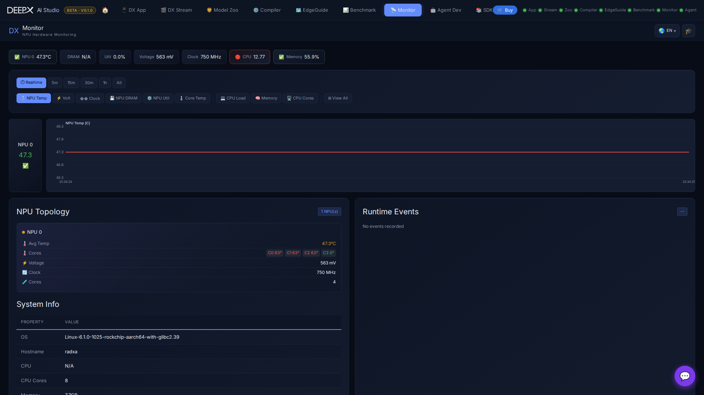

# DX Monitor

A real-time hardware dashboard for your DEEPX NPU and host — temperature, voltage,
clock, DRAM, and utilization, alongside CPU and memory, plus the installed SDK / driver
versions.

## Using it

Step 1. Open the dashboard — live **NPU** telemetry per device (temperature, voltage, clock,
   DRAM, per-core utilization) and **system** stats (CPU per-core, load, memory).  

Step 2. Pick a **time range** (Realtime / 5m / 15m / 30m / 1h / All — up to ~12h history) and
   switch which metric the charts show, or "View All" as a grid.  
   
Step 3. Watch the live charts while you run inference or benchmarks in the other tools; charts
   stream over SSE (with a polling fallback shown when SSE is down).  

## Key features

- **Live NPU telemetry** per device with warn / critical **threshold alerts** (limit lines
  on the charts), per-core NPU temperature, and per-channel DRAM temperature.  
- **NPU Topology** — firmware, chip / variant, board, DDR type / freq / size, per-core util.  
- **DDR ECC alerts** — single-/double-bit error (SBE/DBE) warnings.  
- **Runtime Events log** — INFO / WARN / ERROR / CRITICAL entries from the runtime.  
- **System stats** — CPU per-core, load, memory.  
- **Version info** — DX-RT / PCIe driver / DX Engine / SDK / OS / Python versions, uptime.  
- Falls back to **mock telemetry** when no NPU is present (for exploring the UI).  

!!! note  
    The same version and device information is available on the command line via
    `dxrt-cli --status`.
