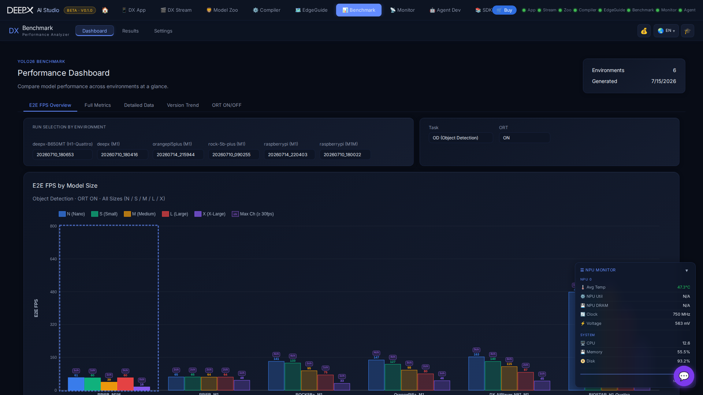

# DX Benchmark

Browse and compare DEEPX NPU benchmark results in your browser — throughput, latency,
and multi-stream numbers per model, with charts.

## Pages

There are three top-level tabs: **Dashboard**, **Results**, and **Settings**.

- **Dashboard** — throughput (FPS), latency (ms), and multi-stream **channel** figures per
  model. Compare across **NPU environments / host PCs side by side**, filter by task and
  model size, toggle ONNX-runtime on/off, and click a chart bar or table row to drill in.  
  Panels show environment details and the benchmarked-model specs. It has five sub-tabs:
    - **E2E FPS Overview** — end-to-end FPS by model size, with a run selector per
      environment.  
    - **Full Metrics** — the full metric set (latency, throughput, E2E FPS, max channels)
      per model; drilling into an environment also shows its **NPU identity** (Product,
      SKU, Modules, Device Count) alongside host/driver/firmware details.  
    - **Detailed Data** — a per-model, per-task table that also surfaces **NPU thermal
      data** (min/max temperature and clock, with a **Throttled** badge when thermal
      throttling was detected during the run) and a **run-status** column (Partial /
      Timeout / Error) for any metric that didn't complete cleanly.  
    - **Version Trend** — a metric line chart across historical runs, to see performance
      move between versions.  
    - **ORT ON/OFF** — a side-by-side comparison of ONNX-runtime on vs. off, per model
      size.  
- **Results** — browse past runs by hardware and run-ID; open each run's Markdown report
  and raw JSON.  
- **Settings** — the (read-only) deployment config: directories, thermal cooldown,
  iterations / warm-up / FPS threshold. Submitting a change is rejected by the server
  (HTTP 501, "deployment-fixed"); adjust these via configuration files before starting
  the server instead.  

A one-click link hands the current selection to **[DX EdgeGuide](09_DX_EdgeGuide.md)**,
which uses the same data to recommend hardware.  

*What "max-channel" means:* the highest number of simultaneous video streams a model
sustains on that NPU while meeting the FPS threshold.  

!!! note  
    The dashboard is **read-only**; benchmarks are produced by the standalone
    `dx-benchmark` CLI (`cd dx-benchmark && ./run.sh run`), and their results feed this
    view (and DX EdgeGuide).
