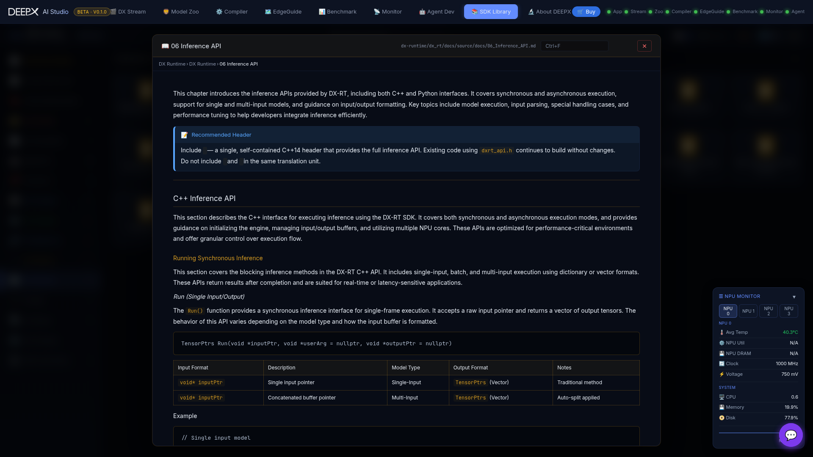

# SDK Library & About

Besides the eight tools, the hub hosts two reference views.

## SDK Library

An in-app library of DEEPX documentation and marketing material, reachable from the hub.  

- **Documentation** — renders the DEEPX SDK markdown docs (architecture overview,
  environment setup, first-model walkthrough, version compatibility, FAQ, and each
  sub-project's guides) directly in the browser, with images and tables.  
- **Brochures & Briefs** — product brochures and chip / module briefs as in-app PDFs.  
- **Search & deep links** — library-wide search plus in-document find (`Ctrl+F`, with
  next / prev and a match counter). Toggle **list / cabinet** view, or open the
  **architecture diagram** overlay. The open document, view mode, and query are captured
  in the URL, so a link reopens exactly that state.  

## About DEEPX

The **About DEEPX** page introduces the company behind the studio — the "AI for Everyone
& Everywhere" mission, at-a-glance figures (patents, commercial orders, global offices,
year founded), and a **Developer Hub** with quick links to the model catalog, SDK,
hardware, and support.

## Chat / AI Assistant

The **💬 assistant** is available in every DX AI Studio module (not just this one). Click
it anytime to ask about DeepX models, the SDK, the compiler, or how any module works — it
draws on bundled DEEPX SDK knowledge to answer.  

In chat settings (⚙️) you can pick from **seven providers**:  

- **API-key providers** — OpenAI, Anthropic, Google, GitHub Models, or a **Custom**
  (OpenAI-compatible) endpoint.  
- **Fully offline, no cloud key needed** — **Local** (your own Ollama-compatible server)
  or **Coding-agent CLI** (reuse an already-logged-in `claude` / `copilot` / `cursor-agent`
  / `codex` / `opencode` session — no separate API key).  

With no provider configured, the assistant falls back to built-in keyword-based guidance
rather than failing outright. Use **Refresh knowledge** (⚙️) to re-sync the assistant's
SDK knowledge with the latest `.deepx` docs.  

The in-app tutorial's chatbot walkthrough (providers, offline options, refresh knowledge)
is now centralized in the launcher's onboarding tour, rather than repeated per-module.  

## About DEEPX

The **About DEEPX** page presents company and product information down one scrolling page
with a sticky section nav (scroll-spy): a **Developer** section (dev-resource cards, CTAs,
and distribution channels), a **Company** section (vision, milestones timeline, global
offices), the DXNN SDK **full-stack architecture**, and **Products**, **Partners**,
**Awards**, and **News** sections — plus a shortcut to the DEEPX store. Available in all
six UI languages.  
