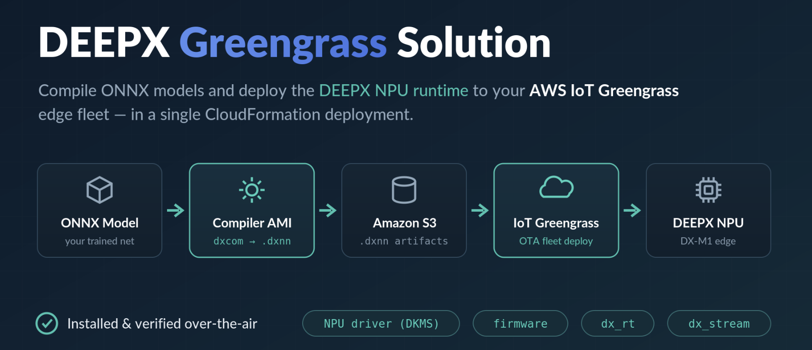
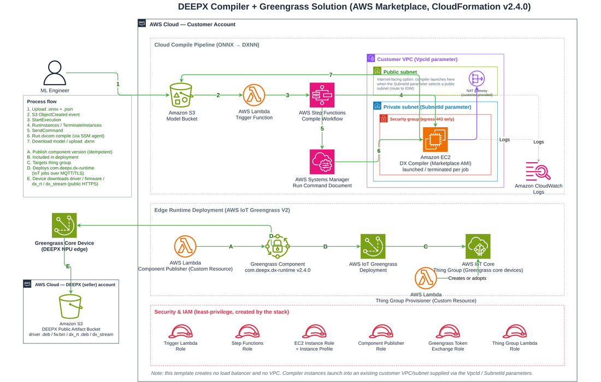
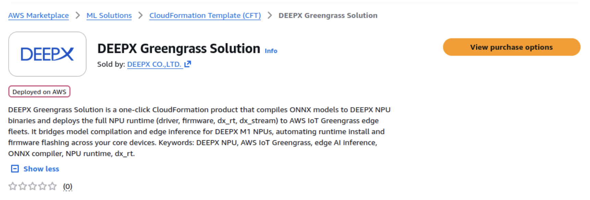
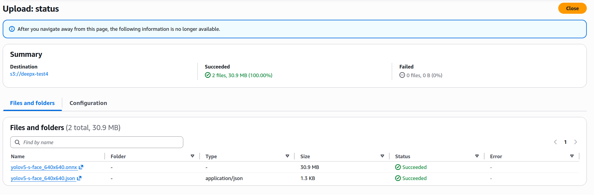
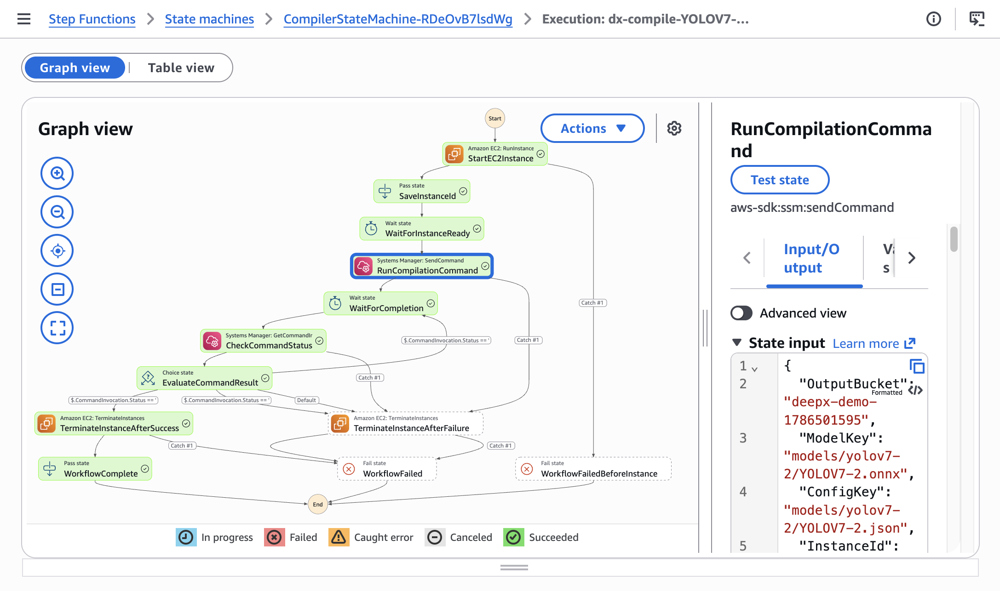
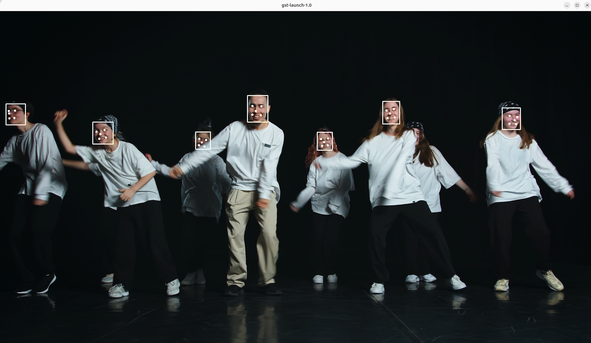

# DEEPX Greengrass Solution

**엣지 AI 배포 단순화 — DEEPX DX-M1 NPU와 AWS IoT를 통한 OTA 배포**

엣지 AI의 가치는 모델을 현장에서 안정적으로 실행할 때 완성됩니다. 모델을 한 번 실행하는 데서 그치지 않고, 서로 다른 장비에 같은 실행 환경을 배포하고 운영 상태와 버전을 일관되게 관리할 수 있어야 합니다.

카메라 한 대와 엣지 AI 디바이스 한 대에서 모델을 실행하는 것은 비교적 간단합니다. 하지만 여러 매장, 공장, 물류 거점에 디바이스가 늘어나면 이야기가 달라집니다. 각 디바이스의 운영체제와 커널에 맞는 NPU 드라이버를 설치하고, 펌웨어와 런타임 버전을 맞추고, 클라우드에서 학습한 모델을 NPU가 실행할 수 있는 형식으로 변환해야 합니다. 현장마다 이 과정을 반복하면 배포 시간이 길어지고 버전 불일치 가능성도 커집니다.

이 문서에서는 DEEPX DX-M1 계열 NPU와 AWS IoT 서비스를 결합해 이 과정을 단순화하는 방법을 설명합니다. 먼저 AWS Marketplace를 통해 DEEPX 컴파일 환경과 AWS 리소스를 준비한 뒤, ONNX 모델을 DEEPX NPU용 DXNN 형식으로 변환합니다. 이어서 AWS IoT Core로 디바이스를 클라우드와 연결하고, AWS IoT Greengrass를 엣지 플랫폼으로 사용해 NPU 드라이버, 펌웨어, dx_rt 런타임, dx_stream 미디어 파이프라인을 디바이스 그룹에 OTA 방식으로 배포합니다.

!!! note "핵심 요약"
    DEEPX는 저전력 온디바이스 추론을 담당하고, AWS IoT Core와 AWS IoT Greengrass는 디바이스 연결, 그룹 단위 배포, 컴포넌트 수명 주기와 업데이트 상태를 관리합니다. 두 제품을 결합하면 모델을 NPU용으로 준비하는 과정과 여러 엣지 장비에 동일한 실행 환경을 배포하는 과정을 하나의 흐름으로 연결할 수 있습니다.

이 문서는 다음 순서로 진행합니다.

1. DEEPX NPU 소개 및 엣지 AI 배포 과제
2. DEEPX와 AWS IoT를 결합한 전체 아키텍처
3. AWS Marketplace로 컴파일 환경 준비하기
4. AWS IoT Core 및 Greengrass를 통한 런타임 OTA 배포
5. 엣지 디바이스에서 배포와 추론 확인

---

## 1. DEEPX NPU 소개 및 엣지 AI 배포 과제

DEEPX는 전력과 공간이 제한된 엣지 환경에서 딥러닝 추론을 수행하기 위한 NPU를 개발합니다. 이 문서에서 사용하는 DX-M1 계열은 M.2 형태로 호스트에 연결할 수 있는 AI 가속기입니다. DEEPX DX-M1은 Raspberry Pi 5와 같은 Arm 기반 디바이스나 x86 기반 산업용 PC와 결합해 객체 탐지, 얼굴 인식, OCR과 같은 비전 모델을 현장에서 실행할 수 있습니다. 영상이 생성되는 위치에서 바로 추론하면 원본 영상을 항상 클라우드로 전송하지 않아도 되므로 지연 시간과 네트워크 사용량을 줄이는 데 유리합니다.


*그림 1. DEEPX NPU 제품군. 이 문서는 DX-M1 계열 엣지 NPU를 중심으로 설명합니다.*

하지만 현장 운영에서는 NPU 성능만으로 충분하지 않습니다. 디바이스가 늘어날수록 드라이버, 펌웨어, 런타임, 모델의 버전과 배포 상태를 원격으로 관리하고, 운영 데이터를 바탕으로 개선한 모델을 다시 배포할 수 있어야 합니다.

DEEPX는 칩과 함께 ONNX 모델을 NPU 실행 형식인 DXNN으로 변환하는 컴파일러를 제공합니다. 사용자는 AWS Marketplace에서 DEEPX Greengrass Solution을 구독해 필요한 환경을 구성한 뒤, ONNX 모델과 컴파일 설정 JSON을 Amazon S3에 업로드하면 이벤트 기반 컴파일 워크플로가 모델을 DXNN으로 변환하고 결과를 같은 S3 경로에 저장합니다.

AWS IoT Core와 AWS IoT Greengrass는 이 컴파일 흐름을 현장 운영으로 연결합니다. AWS IoT Core는 엣지 디바이스와 Thing Group을 관리하고, AWS IoT Greengrass는 엣지 런타임을 대상 디바이스에 배포합니다. 이렇게 준비된 DXNN 모델은 추론 애플리케이션이 사용할 수 있으며, 모델 아티팩트를 디바이스에 전달하는 방식은 애플리케이션 또는 Greengrass 컴포넌트의 배포 설계에 맞춰 연결할 수 있습니다.

---

## 2. DEEPX와 AWS IoT를 결합한 전체 아키텍처

이러한 운영 과제를 해결하려면 모델을 NPU가 실행할 수 있는 형식으로 준비하는 과정과, 준비된 실행 환경을 여러 디바이스에 일관되게 배포하는 과정이 연결되어야 합니다. DEEPX Compiler와 AWS IoT Core, AWS IoT Greengrass는 각각 이 흐름의 다른 역할을 담당합니다.



*그림 2. 모델 준비와 엣지 배포를 연결하는 DEEPX Greengrass Solution의 전체 흐름*

| 특징 | 설명 |
| :--- | :--- |
| **단일 스택 배포** | AWS CloudFormation 스택 하나로 클라우드 모델 컴파일 인프라와 엣지 런타임 배포 환경을 함께 구성합니다. |
| **이벤트 기반 컴파일 파이프라인** | Amazon S3, AWS Lambda, AWS Step Functions 기반 워크플로가 ONNX 모델을 DEEPX NPU용 DXNN 형식으로 변환합니다. 컴파일용 EC2 인스턴스는 작업할 때만 실행되고 완료 후 종료됩니다. |
| **런타임 자동 배포 (ZTP)** | AWS IoT Greengrass를 통해 NPU 드라이버, 펌웨어, dx_rt, dx_stream을 OTA 방식으로 설치합니다. 클래식 Greengrass nucleus와 경량 디바이스용 Greengrass nucleus lite를 모두 지원합니다. |

전체 흐름은 크게 두 부분입니다. 첫 번째는 클라우드에서 ONNX 모델을 DEEPX NPU가 실행할 수 있는 DXNN 아티팩트로 변환하는 모델 준비 단계입니다. 두 번째는 AWS IoT Core에 연결된 디바이스를 Thing Group으로 묶고, Greengrass 배포를 통해 DEEPX 런타임 컴포넌트를 디바이스에 전달하는 엣지 배포 단계입니다.



*그림 3. 클라우드 컴파일 파이프라인과 AWS IoT Greengrass 런타임 배포 아키텍처*

클라우드에서는 ONNX 모델과 컴파일 설정 JSON을 Amazon S3에 업로드하면 이벤트 기반 워크플로가 시작됩니다. AWS Lambda와 AWS Step Functions는 DEEPX Compiler AMI 기반 EC2 인스턴스를 일시적으로 실행하고, AWS Systems Manager Run Command로 `dxcom` 컴파일러를 호출합니다. 컴파일이 완료되면 DXNN 아티팩트는 S3에 저장되고, EC2 인스턴스는 종료됩니다. 실행 상태와 상세 로그는 AWS Step Functions와 Amazon CloudWatch Logs에서 확인할 수 있습니다.

엣지에서는 AWS IoT Core가 디바이스와 Thing Group을 관리하고, AWS IoT Greengrass가 그룹 단위로 DEEPX 런타임을 배포합니다. 디바이스는 AWS IoT Greengrass 컴포넌트를 통해 NPU 드라이버, 펌웨어, dx_rt, dx_stream을 설치하고 배포 상태를 클라우드에 보고합니다. 이를 통해 개별 장비에 직접 접속하지 않고도 동일한 실행 환경을 여러 엣지 디바이스에 일관되게 적용할 수 있습니다.

### Zero-Touch Provisioning

현장 배포와 운영을 쉽게 하기 위해, DEEPX Greengrass Solution은 Zero-Touch Provisioning(ZTP)을 제공합니다. 등록된 디바이스를 Thing Group에 추가하면 Greengrass가 `com.deepx.dx-runtime` 컴포넌트를 전달해 드라이버, 펌웨어, dx_rt, dx_stream을 자동으로 설치하고 결과를 클라우드에 보고합니다. 운영자는 장비별 SSH 접속 없이 신규 장비와 런타임 업데이트를 그룹 단위로 일관되게 관리할 수 있습니다.

!!! note "ZTP의 범위"
    이 문서의 ZTP 범위는 AWS IoT Core에 등록된 디바이스에 실행 환경을 자동 배포하는 과정입니다. 제조 단계의 인증서 주입이나 첫 부팅 시 Fleet Provisioning까지 자동화하려면 별도의 디바이스 프로비저닝 설계가 필요합니다.

---

## 3. AWS Marketplace로 컴파일 환경 준비하기

앞 절에서는 ONNX 모델을 DXNN으로 변환하는 클라우드 컴파일 경로와, Greengrass를 통해 런타임을 엣지 디바이스에 배포하는 흐름을 살펴봤습니다. 이 절에서는 그중 모델 준비 경로를 직접 구성하고 실행합니다. AWS Marketplace에서 DEEPX 솔루션을 구독하고 CloudFormation 스택을 배포한 뒤, 예제 ONNX 모델을 S3에 업로드해 DXNN 결과와 컴파일 로그를 확인합니다.

### 사전 준비 사항

실습을 시작하기 전에 다음 항목을 준비합니다.

- CloudFormation 스택을 생성할 수 있는 AWS 계정과 권한
- DEEPX DX-M1 M.2 모듈이 장착된 엣지 디바이스. 예를 들어 Raspberry Pi 5 같은 arm64 호스트 또는 x86_64 Ubuntu 호스트를 사용할 수 있습니다.
- AWS IoT Greengrass Core V2가 설치되고 AWS IoT Core에 등록된 디바이스. 런타임 OTA 배포 대상이라면 해당 디바이스가 Thing Group에 포함되어 있어야 합니다.
- 컴파일할 ONNX 모델과 JSON 설정 파일
- 컴파일러 EC2 인스턴스를 실행할 기존 VPC와 서브넷. 서브넷은 Amazon S3, AWS Systems Manager, Amazon CloudWatch Logs 등 필요한 AWS 서비스에 HTTPS로 연결할 수 있어야 합니다. 프라이빗 서브넷을 사용한다면 NAT Gateway 또는 필요한 VPC 엔드포인트를 구성합니다.

### Marketplace 구독 및 환경 준비

AWS Marketplace에서 [DEEPX Greengrass Solution](https://aws.amazon.com/marketplace/pp/prodview-732s46qfzuh34)을 구독합니다. 소프트웨어 구독 비용은 없으며, 컴파일과 배포에 사용하는 AWS 리소스 비용만 발생합니다. 엣지 디바이스 런타임 배포 없이 모델 컴파일 기능만 사용하려면 [DEEPX Compiler Solution](02_DEEPX_Compiler_Solution_kor.md)을 구독할 수 있습니다.



*그림 4. AWS Marketplace의 DEEPX 솔루션 구독 화면*

**단계 1.** AWS Marketplace에서 DEEPX Greengrass Solution을 검색해 선택한 뒤 구독합니다.

**단계 2.** 배포할 AWS Region을 선택하고 **Launch with CloudFormation**을 선택합니다.

**단계 3.** 스택 생성에 필요한 값을 입력합니다.

| 파라미터 | 설명 |
| :--- | :--- |
| `ImageId` | DX Compiler AMI를 가리키는 SSM 파라미터 경로입니다. Region별 AMI ID로 자동 해석되므로 기본값을 그대로 사용합니다. |
| `ModelBucketName` | ONNX 입력 파일과 DXNN 컴파일 결과를 저장할 S3 버킷 이름입니다. 전역에서 고유해야 합니다. |
| `InstanceType` | 컴파일에 사용할 EC2 인스턴스 유형입니다. 기본값은 `t3.xlarge`입니다. |
| `VpcId` / `SubnetId` | 컴파일러 인스턴스를 실행할 기존 VPC와 서브넷입니다. Amazon S3, AWS Systems Manager, Amazon CloudWatch Logs 등 AWS 서비스에 HTTPS로 나갈 수 있어야 합니다. |
| `ThingGroupName` | 런타임 배포 대상 IoT Thing Group 이름입니다. 비워 두면 `<스택명>-cores` 그룹이 생성되고, 기존 그룹 이름을 입력하면 해당 그룹을 사용합니다. |

**단계 4.** **Next**를 선택해 검토 화면으로 이동한 뒤 **Submit**을 선택합니다.

스택 생성이 완료되면 CloudFormation **Outputs**에서 `ModelBucketName`, `StateMachineArn`, `CompilerExecutionLogGroupName`을 확인합니다. 이후 과정에서는 이 값으로 모델 업로드, 워크플로 상태, 컴파일 로그를 확인합니다.

### ONNX 모델 업로드 및 자동 컴파일

컴파일할 모델과 설정 파일을 준비합니다. 직접 학습한 모델 외에도 [DEEPX Model Zoo](https://developer.deepx.ai/modelzoo/)에서 DEEPX NPU용으로 검증된 사전 학습 모델을 내려받아 바로 컴파일할 수 있습니다. 이 예제에서는 `yolov5-s-face_640x640.onnx` 모델과 같은 이름의 JSON 설정 파일을 사용합니다. 두 파일은 같은 S3 경로에 업로드해야 하며, 다른 모델의 설정 파일이 섞이지 않도록 모델별 전용 prefix를 사용합니다.

설정 파일에는 입력 텐서 형상과 캘리브레이션 방식을 정의합니다. `dataset_path`에는 로컬 경로를 넣을 수 있지만, 이 솔루션은 컴파일 시 해당 값을 AMI에 포함된 캘리브레이션 데이터셋 경로인 `/opt/dx-compiler/calibration_dataset`으로 자동 치환합니다.

```json
{
  "inputs": {
    "input.1": [1, 3, 640, 640]
  },
  "calibration_num": 100,
  "calibration_method": "ema",
  "default_loader": {
    "dataset_path": "/mnt/datasets/widerface/WIDER_val/images",
    "file_extensions": ["jpeg", "jpg", "png"]
  }
}
```

이제 ONNX 모델과 JSON 설정 파일을 같은 S3 prefix에 업로드해 컴파일을 시작합니다. 아래 명령은 CloudFormation Outputs에서 모델 버킷 이름을 가져오고, DEEPX Model Zoo 예제 모델을 내려받은 뒤, 모델별 전용 경로에 두 파일을 업로드합니다.

```bash
export STACK_NAME=<cloudformation-stack-name>

export MODEL_BUCKET=$(aws cloudformation describe-stacks \
  --stack-name "$STACK_NAME" \
  --query "Stacks[0].Outputs[?OutputKey=='ModelBucketName'].OutputValue" \
  --output text)

export MODEL_PREFIX=models/yolov5-s-face_640x640

# ONNX 모델 내려받기
curl -fLO https://sdk.deepx.ai/modelzoo/onnx/yolov5-s-face_640x640.onnx

# 위의 설정 파일 예시를 같은 이름의 JSON으로 저장
cat > yolov5-s-face_640x640.json <<'EOF'
{
  "inputs": {
    "input.1": [1, 3, 640, 640]
  },
  "calibration_num": 100,
  "calibration_method": "ema",
  "default_loader": {
    "dataset_path": "/mnt/datasets/widerface/WIDER_val/images",
    "file_extensions": ["jpeg", "jpg", "png"]
  }
}
EOF

aws s3 cp --only-show-errors yolov5-s-face_640x640.onnx "s3://${MODEL_BUCKET}/${MODEL_PREFIX}/"
aws s3 cp --only-show-errors yolov5-s-face_640x640.json "s3://${MODEL_BUCKET}/${MODEL_PREFIX}/"
```



*그림 5. ONNX 모델과 컴파일 설정 파일을 같은 Amazon S3 경로에 업로드*

두 파일이 업로드되면 Amazon S3 이벤트가 워크플로를 시작합니다. AWS Step Functions 콘솔에서 워크플로 진행 상태를 확인할 수 있으며, 워크플로는 인스턴스 시작, 컴파일 실행, 상태 폴링, 인스턴스 종료 순으로 진행됩니다. 실패 경로에서도 인스턴스를 종료하도록 설계되어 있습니다.



*그림 6. AWS Step Functions 컴파일 워크플로 실행 결과 (Succeeded)*

다음 명령으로 최근 실행 상태를 확인합니다.

```bash
export STATE_MACHINE_ARN=$(aws cloudformation describe-stacks \
  --stack-name "$STACK_NAME" \
  --query "Stacks[0].Outputs[?OutputKey=='StateMachineArn'].OutputValue" \
  --output text)

aws stepfunctions list-executions \
  --state-machine-arn "$STATE_MACHINE_ARN" \
  --max-results 5 \
  --query "executions[].[status,startDate,stopDate,name]" \
  --output table
```

완료 후 원본 모델과 같은 S3 디렉터리에서 컴파일된 `.dxnn` 파일을 확인합니다. 컴파일 상세 로그는 Amazon CloudWatch Logs의 `/dx-compiler/<스택명>/execution` 로그 그룹에 기록됩니다.

```bash
export COMPILER_LOG_GROUP=$(aws cloudformation describe-stacks \
  --stack-name "$STACK_NAME" \
  --query "Stacks[0].Outputs[?OutputKey=='CompilerExecutionLogGroupName'].OutputValue" \
  --output text)

aws logs tail "$COMPILER_LOG_GROUP" --since 1h --follow
```

로그에서 모델과 JSON 파일의 S3 다운로드, `dxcom` 실행, `.dxnn` 업로드 메시지를 순서대로 확인합니다.

```bash
aws s3 ls "s3://${MODEL_BUCKET}/${MODEL_PREFIX}/"
# yolov5-s-face_640x640.onnx
# yolov5-s-face_640x640.json
# yolov5-s-face_640x640.dxnn
```

이 방식은 컴파일 작업이 있을 때만 EC2 인스턴스를 실행하고 종료하므로 상시 컴파일 서버를 운영할 필요가 없습니다.

---

## 4. DEEPX 런타임을 AWS IoT Greengrass로 엣지에 배포하기

이 단계에서는 AWS IoT Core에 등록되고 대상 Thing Group에 포함된 Greengrass 코어 디바이스에 DEEPX 런타임을 배포합니다. AWS IoT Core는 디바이스, 인증서, Thing Group을 관리하고, AWS IoT Greengrass는 해당 그룹을 대상으로 컴포넌트와 설정을 OTA 배포합니다. 즉, 운영자는 각 장비에 SSH로 접속하지 않고도 동일한 실행 환경을 그룹 단위로 적용하고 상태를 확인할 수 있습니다.

!!! note "`com.deepx.dx-runtime` 컴포넌트"
    CloudFormation 스택이 게시하는 Greengrass 컴포넌트입니다. 대상 디바이스에 NPU 드라이버, 펌웨어, dx_rt, dx_stream을 설치해 DXNN 모델을 실행할 DEEPX 런타임 환경을 준비하고, 설치 결과를 Greengrass에 보고합니다.

CloudFormation 스택에서 게시한 `com.deepx.dx-runtime` 컴포넌트는 다음 소프트웨어를 순서대로 설치합니다.

- **NPU 리눅스 드라이버**: DKMS를 사용해 대상 디바이스의 커널에 맞게 드라이버를 구성
- **펌웨어**: `dxcli`를 이용해 DX-M1 NPU 펌웨어를 업데이트
- **dx_rt**: NPU 인식과 모델 실행을 위한 DEEPX C/C++ 런타임
- **dx_stream**: OpenCV와 GStreamer를 연계한 영상 추론 파이프라인

스택은 이 컴포넌트를 대상 Thing Group에 배포합니다. `ThingGroupName`을 지정했다면 해당 그룹을 사용하고, 비워 두었다면 `<스택명>-cores` 그룹을 생성합니다. 해당 그룹에 코어 디바이스가 포함되어 있으면 Greengrass 배포가 자동으로 시작됩니다.


*그림 7. AWS IoT Greengrass 배포 상태에서 대상 디바이스의 성공 여부 확인*

Greengrass 콘솔에서 배포 상태가 **Completed**가 되었는지 확인합니다. 문제가 발생한 디바이스는 컴포넌트 로그로 진단할 수 있습니다. 클래식 Greengrass nucleus와 nucleus lite의 로그 확인 방법은 다음과 같습니다.

```bash
# 클래식 Greengrass nucleus
sudo tail -f /greengrass/v2/logs/com.deepx.dx-runtime.log

# Greengrass nucleus lite
sudo journalctl -f -u ggl.com.deepx.dx-runtime.service
```

!!! note "설치 소요 시간"
    설치 시간은 디바이스 사양과 네트워크 상태에 따라 달라집니다. 의존성 라이브러리를 소스에서 빌드하는 저사양 arm64 디바이스에서는 수십 분 이상 걸릴 수 있습니다.

새 드라이버나 런타임 버전을 배포할 때도 컴포넌트 버전을 올리고 대상 Thing Group에 새 배포를 생성하는 방식을 사용합니다. 이것이 Greengrass를 단순 설치 도구가 아니라 엣지 운영 플랫폼으로 사용하는 이유입니다.

---

## 5. 엣지 디바이스에서 배포와 추론 확인

Greengrass 배포가 완료되면 `dxcli`로 NPU 인식 상태와 펌웨어 버전을 확인합니다. 이어서 dx_stream의 GStreamer 플러그인이 정상 등록되었는지 확인합니다.

```bash
# NPU와 펌웨어 상태 확인
dxcli -s

# dx_stream 실행 파일과 라이브러리 경로 설정
GST_ARCH_TRIPLET="$(gcc -dumpmachine 2>/dev/null || true)"
if [ -z "$GST_ARCH_TRIPLET" ]; then
  case "$(uname -m)" in
    x86_64) GST_ARCH_TRIPLET="x86_64-linux-gnu" ;;
    aarch64|arm64) GST_ARCH_TRIPLET="aarch64-linux-gnu" ;;
    armv7l|armv6l) GST_ARCH_TRIPLET="arm-linux-gnueabihf" ;;
    *) GST_ARCH_TRIPLET="$(uname -m)-linux-gnu" ;;
  esac
fi

GST_PLUGIN_DIR="/usr/local/lib/$GST_ARCH_TRIPLET/gstreamer-1.0"
export GST_PLUGIN_PATH="$GST_PLUGIN_DIR:$GST_PLUGIN_PATH"
export LD_LIBRARY_PATH="$GST_PLUGIN_DIR:/usr/local/share/gstdxstream/lib:$LD_LIBRARY_PATH"
export PATH="/usr/local/share/gstdxstream/bin:/usr/local/bin:$PATH"

# dx_stream GStreamer 플러그인 확인
gst-inspect-1.0 dxstream
```

현재 스택은 런타임을 Greengrass로 배포하고, 컴파일된 DXNN 모델은 S3에 저장합니다. 따라서 아래 명령은 추론 검증을 위해 DXNN 모델을 디바이스에 수동으로 내려받는 예시입니다. 모델도 OTA로 배포하려면 DXNN 아티팩트와 실행 명령을 포함한 별도 Greengrass 컴포넌트를 만들어야 합니다.

```bash
aws s3 cp "s3://${MODEL_BUCKET}/${MODEL_PREFIX}/yolov5-s-face_640x640.dxnn" .
```

이어서 테스트용 샘플 영상을 내려받고 dx_stream 파이프라인으로 추론을 실행합니다. `dxpreprocess`가 영상 프레임을 모델 입력 크기(640×640)로 변환하고, `dxinfer`가 NPU에서 추론을 수행합니다. `dxpostprocess`는 YOLOv5s-Face 후처리 라이브러리로 검출 결과를 해석하고, `dxosd`가 바운딩 박스를 영상에 그려 `fpsdisplaysink`가 FPS와 함께 화면에 표시합니다.

!!! note "모델을 바꿀 경우"
    후처리 라이브러리는 모델에 종속적입니다. 다른 모델을 사용한다면 `model-path`와 함께 `library-file-path`도 해당 모델의 후처리 라이브러리로 변경해야 합니다.

```bash
curl -fSLO https://sdk.deepx.ai/res/video/sample_videos.tar.gz
tar xzf sample_videos.tar.gz

export MODEL_PATH="$PWD/yolov5-s-face_640x640.dxnn"
export INPUT_VIDEO_PATH="$PWD/dance-group.mov"
export VIDEOCONVERT_PIPELINE="videoconvert"

gst-launch-1.0 urisourcebin uri=file://$INPUT_VIDEO_PATH ! decodebin ! \
  dxpreprocess preprocess-id=1 resize-width=640 resize-height=640 ! \
  queue max-size-buffers=1 ! \
  dxinfer preprocess-id=1 inference-id=1 model-path=$MODEL_PATH ! \
  queue max-size-buffers=1 ! \
  dxpostprocess inference-id=1 \
  library-file-path=/usr/local/share/gstdxstream/lib/libpostprocess_yolov5s_face.so \
  function-name=PostProcess ! \
  queue max-size-buffers=1 ! dxosd ! \
  $VIDEOCONVERT_PIPELINE ! fpsdisplaysink sync=false
```



*그림 8. DEEPX dx_stream에서 실행한 얼굴 검출 예시*

---

## 비용 안내

DEEPX Greengrass Solution의 소프트웨어 구독 비용은 없습니다. 다만 다음 AWS 리소스 사용량에 따라 비용이 발생합니다.

- **Amazon EC2**: 컴파일러 인스턴스는 컴파일 작업 중에만 실행되고 성공과 실패 경로 모두에서 종료됩니다. 따라서 컴파일 시간에 대해서만 비용이 발생합니다.
- **Amazon S3, AWS Lambda, AWS Step Functions, Amazon CloudWatch Logs**: 모델 파일 저장, 이벤트 처리, 워크플로 실행, 로그 보관에 따른 비용이 발생합니다.
- **AWS IoT Core 및 AWS IoT Greengrass**: 디바이스 연결과 배포 운영에 따른 비용은 사용하는 기능과 디바이스 수에 따라 달라집니다.

실제 비용은 모델 크기, 컴파일 시간, 리전, 디바이스 수, 로그 보관 기간에 따라 달라집니다. 배포 전에는 [AWS Pricing Calculator](https://calculator.aws/)와 각 서비스의 최신 요금을 기준으로 예상 비용을 확인합니다.

## 리소스 정리

실습을 마친 뒤에는 다음 순서로 리소스를 정리해 지속적인 비용 발생을 방지합니다.

1. CloudFormation 콘솔에서 스택을 삭제합니다. 스택이 생성한 Thing Group과 컴포넌트 버전은 함께 정리되지만, 기존에 존재해 스택이 사용한 그룹은 삭제되지 않습니다.
2. 모델 버킷은 데이터 보호를 위해 스택 삭제 후에도 유지됩니다. 더 이상 필요하지 않다면 버킷을 비우고 직접 삭제합니다.
3. AWS Marketplace 구독이 더 이상 필요 없다면 [Manage subscriptions](https://aws.amazon.com/marketplace/library)에서 구독을 취소합니다.
4. (선택) Greengrass 콘솔에서 배포를 수정해 디바이스에서 컴포넌트를 제거합니다.

## 결론

이 문서에서는 DEEPX DX-M1 계열 NPU와 AWS IoT 서비스를 결합해 엣지 AI 모델을 준비하고 실행 환경을 배포하는 전체 흐름을 살펴봤습니다. AWS Marketplace와 CloudFormation으로 컴파일 및 배포 리소스를 구성하고, Amazon S3에 업로드한 ONNX 모델을 DXNN으로 변환했습니다. 이어서 AWS IoT Core의 Thing과 Thing Group으로 디바이스를 관리하고, Greengrass 컴포넌트를 통해 엣지 런타임을 OTA로 배포했습니다.

이 조합의 가치는 단순히 NPU에서 모델이 한 번 실행되는 데 있지 않습니다. 모델 개발자가 만든 아티팩트를 현장 장비가 실행할 수 있는 형태로 연결하고, 새 장비와 새 소프트웨어 버전이 추가될 때 같은 배포 방식을 반복할 수 있다는 점에 있습니다. DX-M1 모듈 기반의 보안 프로비저닝까지 연결되면, 전원과 네트워크를 연결한 뒤 AWS IoT Core 등록부터 AWS IoT Greengrass 런타임 구성까지 현장 개입을 더 줄이는 플러그 앤 플레이 경험으로 확장할 수 있습니다.

## 참고 자료

- [DEEPX Greengrass Solution — AWS Marketplace](https://aws.amazon.com/marketplace/pp/prodview-732s46qfzuh34)
- [DX-Compiler (AMI) — AWS Marketplace](https://aws.amazon.com/marketplace/pp/prodview-ev6ed5omu4ulo)
- [AWS IoT Core 개발자 안내서](https://docs.aws.amazon.com/iot/latest/developerguide/what-is-aws-iot.html)
- [AWS IoT Greengrass V2 개발자 안내서](https://docs.aws.amazon.com/greengrass/v2/developerguide/what-is-iot-greengrass.html)
- [AWS IoT Greengrass 배포 관리](https://docs.aws.amazon.com/greengrass/v2/developerguide/manage-deployments.html)
- [AWS IoT Fleet Provisioning](https://docs.aws.amazon.com/iot/latest/developerguide/provision-wo-cert.html)
- [AWS CloudFormation](https://docs.aws.amazon.com/AWSCloudFormation/latest/UserGuide/Welcome.html)
- [DEEPX 개발자 문서](https://developer.deepx.ai)
- [DEEPX Model Zoo](https://developer.deepx.ai/modelzoo/)
- [DEEPX dx-all-suite — GitHub](https://github.com/DEEPX-AI/dx-all-suite)
