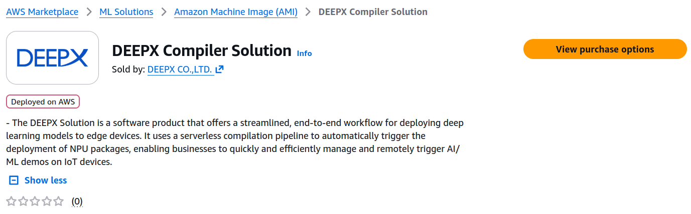
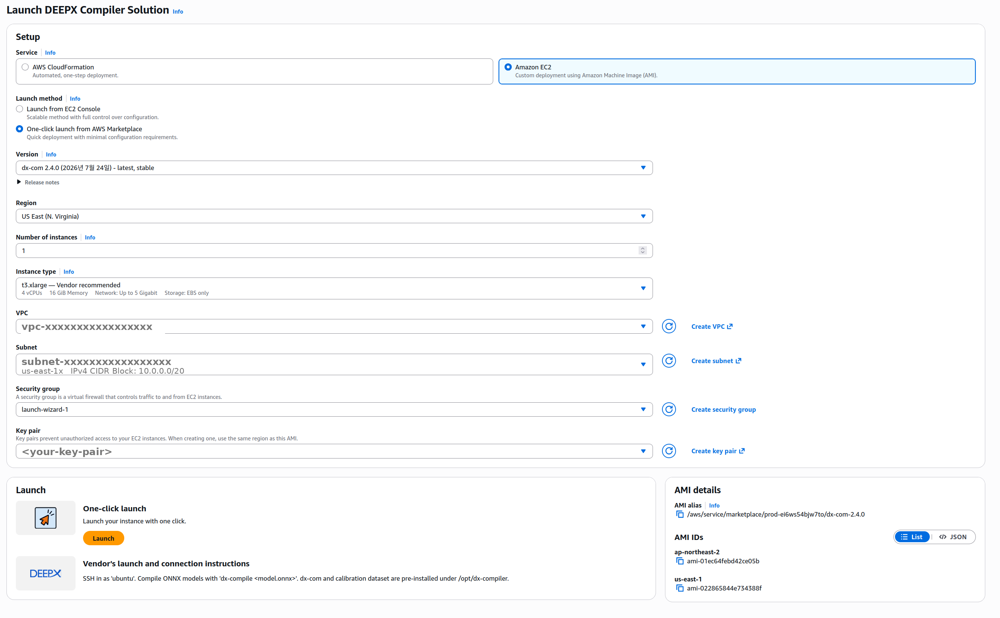
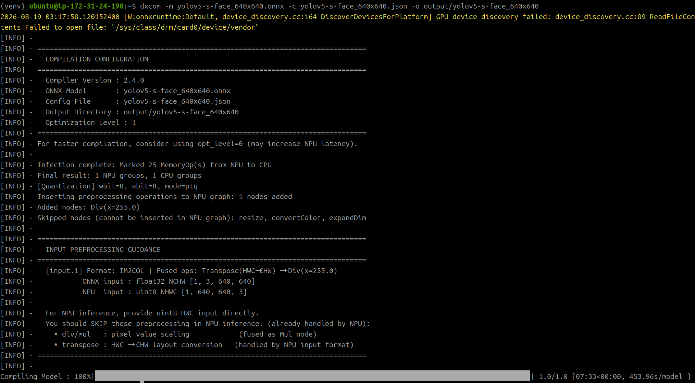
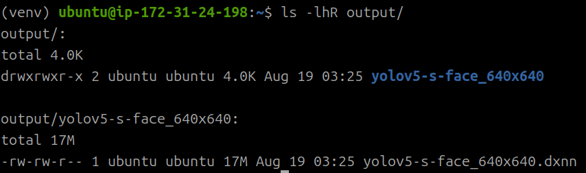

# DEEPX Compiler Solution

**Compiling ONNX models into the DEEPX NPU execution format (DXNN) on AWS**

A DEEPX NPU does not run a standard ONNX model as is. The model must first be converted into the DXNN (`.dxnn`) format, which contains the instruction set and weights the NPU executes. The DEEPX compiler (`dx-com`) performs this conversion. Compilation includes a calibration step for INT8 quantization, so it requires a representative dataset along with sufficient CPU and memory resources.

This document describes how to run that compilation step on AWS using the **DEEPX Compiler Solution**. Instead of building a compilation environment locally, you use the DEEPX Compiler Solution from AWS Marketplace to run the compiler on AWS only when you need it.

!!! note "Scope of this document"
    This document covers **model compilation only**. To deploy a compiled DXNN model to an edge device and install the NPU driver, firmware, and runtime automatically, see [DEEPX Greengrass Solution](01_DEEPX_Greengrass_Solution.md). The Greengrass Solution includes the compilation pipeline described here.

---

## 1. Two Deployment Options

The **DEEPX Compiler Solution** is listed on AWS Marketplace under ML Solutions as an Amazon Machine Image, and its launch page offers two deployment services. Choose the one that fits how you want to work.



*Figure 1. The DEEPX Compiler Solution product page on AWS Marketplace*

| | **Amazon EC2** | **AWS CloudFormation** |
| :--- | :--- | :--- |
| Described on the launch page as | Custom deployment using Amazon Machine Image (AMI) | Automated, one-step deployment |
| How it runs | You launch an instance and run the compiler yourself | You upload files to Amazon S3 and compilation starts automatically |
| Best suited for | Experimenting by changing compilation options repeatedly, interactive debugging | Running a standardized compilation repeatedly, integrating with CI and automation |
| Instance lifecycle | You start and terminate the instance | The workflow starts and terminates the instance |
| Covered in | [Section 3](#3-amazon-ec2-deployment) | [Section 4](#4-aws-cloudformation-deployment) |

Both options use the same compiler and the same calibration dataset, so the compilation result is identical.

---

## 2. Prerequisites

- An AWS account and permissions to launch EC2 instances or create a CloudFormation stack
- The ONNX model to compile and its JSON configuration file. In addition to models you train yourself, you can download pre-trained models validated for DEEPX NPUs from the [DEEPX Model Zoo](https://developer.deepx.ai/modelzoo/) and use them directly.
- An existing VPC and subnet in which to run the instance. The subnet must be able to reach the required AWS services, including Amazon S3, AWS Systems Manager, and Amazon CloudWatch Logs, over HTTPS. If you use a private subnet, configure a NAT gateway or the necessary VPC endpoints.
- Credentials configured locally if you want to run AWS CLI commands from your machine

### Configuring the AWS CLI Locally

Skip this section if you have already configured the AWS CLI.

```bash
aws configure
# AWS Access Key ID [None]: <access-key-id>
# AWS Secret Access Key [None]: <secret-access-key>
# Default region name [None]: <region, for example us-east-1>
# Default output format [None]: json

# Verify that the credentials are configured correctly
aws sts get-caller-identity
```

If the command prints your account ID and user ARN, the configuration is complete.

---

## 3. Amazon EC2 Deployment

Launching the DEEPX Compiler Solution as an Amazon EC2 instance gives you the compiler and the calibration dataset preinstalled under `/opt/dx-compiler`. There is nothing to install: you can start compiling as soon as the instance is up.

### Step 1. Subscribe and Launch an Instance

1. On the Marketplace product page, choose **View purchase options** and subscribe. There is no software subscription charge; you pay only for the AWS resources you use.
2. On the **Launch DEEPX Compiler Solution** page, under **Service**, choose **Amazon EC2**.
3. Under **Launch method**, choose one of the following.
    - **One-click launch from AWS Marketplace** — quick deployment with minimal configuration requirements. This is the path described below.
    - **Launch from EC2 Console** — a scalable method with full control over the configuration. Use this when you need launch options the Marketplace form does not expose, such as instance profiles, user data, or additional volumes.
4. Fill in the setup fields: **Version** (the latest stable `dx-com` release is preselected), **Region**, **Number of instances**, **Instance type**, **VPC**, **Subnet**, **Security group**, and **Key pair**.
5. Choose **Launch**.



*Figure 2. Launch configuration — Service set to Amazon EC2, with the vendor-recommended instance type and the network and key pair settings*

!!! note "Choosing an instance type"
    Compilation is a CPU-intensive and memory-intensive job. The launch page marks `t3.xlarge` (4 vCPUs, 16 GiB memory) as **Vendor recommended**, and the CloudFormation deployment uses the same type by default. Depending on model size and the number of calibration images, a larger instance may perform better.

Configure the security group to allow only the traffic you need. Compilation itself does not require inbound connectivity beyond the SSH access you use to drive it.

The **AMI details** panel on the same page lists the AMI alias and the per-Region AMI IDs. The alias is an AWS Systems Manager parameter path in the form `/aws/service/marketplace/<product-code>/dx-com-<version>`, which is the same mechanism the CloudFormation deployment uses to resolve the image for each Region.

### Step 2. Connect and Prepare the Model

Connect to the instance over SSH as the `ubuntu` user, then prepare the ONNX model to compile and its JSON compilation configuration file. The configuration file format is described in [section 5](#5-compilation-configuration-file-json).

```bash
ssh -i <your-key>.pem ubuntu@<instance-address>

# Download a sample model from the Model Zoo
curl -fLO https://sdk.deepx.ai/modelzoo/onnx/yolov5-s-face_640x640.onnx

# Or retrieve your own model from S3
aws s3 cp s3://<your-bucket>/<path>/model.onnx .
```

Write the compilation configuration file next to the model, pointing `dataset_path` at the calibration dataset bundled in the AMI.

```bash
cat > yolov5-s-face_640x640.json <<'EOF'
{
  "inputs": {
    "input.1": [1, 3, 640, 640]
  },
  "calibration_num": 100,
  "calibration_method": "ema",
  "default_loader": {
    "dataset_path": "/opt/dx-compiler/calibration_dataset",
    "file_extensions": ["jpeg", "jpg", "png"]
  }
}
EOF
```

### Step 3. Run the Compilation

`dxcom` takes the model (`-m`), the configuration file (`-c`), and the **output directory** (`-o`) as arguments. The compiler and the calibration dataset it uses are preinstalled under `/opt/dx-compiler`, and the Python environment the compiler runs in is already active on login.

```bash
dxcom -m yolov5-s-face_640x640.onnx \
      -c yolov5-s-face_640x640.json \
      -o output/yolov5-s-face_640x640
```

The compiler first echoes the compilation configuration — compiler version, model, config file, output directory, and optimization level — then reports quantization and preprocessing decisions before the compilation progress bar.



*Figure 3. Compiling the ONNX model with `dxcom` on the EC2 instance*

!!! note "The `dx-compile` shortcut"
    The vendor's launch and connection instructions on the Marketplace page give a shorter
    form, `dx-compile <model.onnx>`, which wraps `dxcom` with defaults. Use it when you want
    a one-liner; use `dxcom` directly when you need explicit control over the configuration
    file and the output directory. Run `dxcom -h` on the instance for the full option list.

When compilation finishes, the `.dxnn` file is written **inside** the directory you passed to `-o`, named after the model.

```bash
ls -lhR output/
```



*Figure 4. The compiled `.dxnn` artifact in the output directory*

Upload the artifact to S3 so that edge devices or other environments can download and use it.

```bash
aws s3 cp output/yolov5-s-face_640x640/yolov5-s-face_640x640.dxnn s3://<your-bucket>/<path>/
```

### Step 4. Terminate the Instance

Compilation is a one-time job, so terminate the instance when you are done to stop incurring charges. If you expect to compile repeatedly, the CloudFormation deployment in the next section is a better choice for both management and cost.

---

## 4. AWS CloudFormation Deployment

Choosing **AWS CloudFormation** on the launch page gives you an automated, one-step deployment: an event-driven compilation pipeline that nobody has to operate by hand. When you upload a model and a configuration file to Amazon S3, an event starts a workflow that launches a compiler instance, runs the compilation, and then terminates the instance. All you have to do is download the result.

The DEEPX Greengrass Solution deploys this same pipeline as part of its stack, alongside the edge runtime deployment. For that stack's parameters and the end-to-end walkthrough, see the [DEEPX Greengrass Solution](01_DEEPX_Greengrass_Solution.md) document.

### How It Works

1. You upload the `.onnx` model and the `.json` configuration file to the **same path** in the S3 model bucket.
2. An S3 `ObjectCreated` event invokes an AWS Lambda trigger function. The function looks for the matching file in the same path and proceeds to the next step **only when both files are present**. The execution name is generated as a hash based on the file names, which prevents duplicate runs.
3. The AWS Step Functions compilation workflow starts.
4. The workflow launches an Amazon EC2 instance based on the DEEPX Compiler Solution AMI. The instance runs in the existing VPC and subnet specified by the CloudFormation parameters.
5. AWS Systems Manager Run Command sends the compilation commands defined in an SSM document to the instance.
6. The `dxcom` compiler preinstalled on the instance runs. At this point, the `dataset_path` value in the configuration file is automatically replaced with `/opt/dx-compiler/calibration_dataset`, the calibration dataset path included in the AMI.
7. The compiled `.dxnn` binary is uploaded to the same S3 path as the source model. The workflow terminates the instance whether the job succeeds or fails, so there is no idle cost, and you can review execution logs in the Amazon CloudWatch Logs log group (`/dx-compiler/<stack-name>/execution`).

### Example

```bash
export STACK_NAME=<cloudformation-stack-name>

export MODEL_BUCKET=$(aws cloudformation describe-stacks \
  --stack-name "$STACK_NAME" \
  --query "Stacks[0].Outputs[?OutputKey=='ModelBucketName'].OutputValue" \
  --output text)

export MODEL_PREFIX=models/yolov5-s-face_640x640

aws s3 cp --only-show-errors yolov5-s-face_640x640.onnx "s3://${MODEL_BUCKET}/${MODEL_PREFIX}/"
aws s3 cp --only-show-errors yolov5-s-face_640x640.json  "s3://${MODEL_BUCKET}/${MODEL_PREFIX}/"

# Check the result after compilation completes
aws s3 ls "s3://${MODEL_BUCKET}/${MODEL_PREFIX}/"
```

!!! note "Use a dedicated prefix per model"
    The trigger function treats the `.onnx` and `.json` files in the same path as a pair. When you work with several models, use a separate prefix for each one so that configuration files for different models do not get mixed together.

---

## 5. Compilation Configuration File (JSON)

The compilation configuration file defines the input tensor shape and the calibration method used for INT8 quantization. The following is an example for a detection model that takes 640×640 input.

```json
{
    "inputs": {
        "input.1": [1, 3, 640, 640]
    },
    "calibration_num": 100,
    "calibration_method": "ema",
    "default_loader": {
        "dataset_path": "/mnt/datasets/widerface/WIDER_val/images",
        "file_extensions": ["jpeg", "jpg", "png", "JPEG"],
        "preprocessings": [
            {
                "resize": {
                    "mode": "pad",
                    "size": 640,
                    "pad_location": "edge",
                    "pad_value": [114, 114, 114]
                }
            },
            {
                "convertColor": {
                    "form": "BGR2RGB"
                }
            },
            {
                "transpose": {
                    "axis": [2, 0, 1]
                }
            },
            {
                "div": {
                    "x": 255.0
                }
            },
            {
                "expandDim": {
                    "axis": 0
                }
            }
        ]
    }
}
```

| Item | Description |
| :--- | :--- |
| `inputs` | The input tensor names and shapes. These must match the input definition of the ONNX model. |
| `calibration_num` | The number of images to use for calibration |
| `calibration_method` | The calibration algorithm (for example, `ema`) |
| `default_loader.dataset_path` | The path to the calibration dataset |
| `default_loader.preprocessings` | Configure these to match the preprocessing used during training to minimize accuracy loss. |

!!! note "Automatic `dataset_path` replacement"
    When you use the CloudFormation pipeline, whatever value you set for `dataset_path` in the configuration file is automatically replaced at compilation time with the calibration dataset path included in the AMI (`/opt/dx-compiler/calibration_dataset`). This replacement does not apply when you run `dxcom` yourself on an Amazon EC2 instance, so you must specify a path that the instance can actually access.

---

## 6. Working with the DEEPX Model Zoo

Even if you do not have a model of your own, you can download pre-trained ONNX models validated for DEEPX NPUs, along with their corresponding configuration files, from the [DEEPX Model Zoo](https://developer.deepx.ai/modelzoo/) and compile them immediately. Models are available for the main vision tasks, including object detection, face detection, classification, segmentation, and pose estimation, and accuracy figures after INT8 quantization are published as well.

---

## 7. Cost

There is no software subscription charge for the DEEPX Compiler Solution. However, you incur charges for the following AWS resource usage.

- **Amazon EC2**: You are charged for the time the compiler instance runs. The CloudFormation pipeline runs the instance only during a compilation job and terminates it on both success and failure paths, so there is no idle cost. When you launch the instance yourself, you must terminate it yourself.
- **Amazon EBS**: You are charged for the volumes attached to the instance.
- **Amazon S3, AWS Lambda, AWS Step Functions, and Amazon CloudWatch Logs** (CloudFormation deployment): You incur charges for model file storage, event processing, workflow execution, and log retention.

Actual costs vary with model size, compilation time, instance type, Region, and log retention period. Before you deploy, estimate costs using the [AWS Pricing Calculator](https://calculator.aws/) and the current pricing for each service.

---

## 8. Troubleshooting

| Symptom | What to check |
| :--- | :--- |
| The workflow does not start after a file upload (CloudFormation deployment) | Confirm that both the `.onnx` and `.json` files were uploaded to the **same S3 path**. If only one is present, the trigger function waits. |
| The workflow ends in a failure | Review the `dxcom` execution logs in the `/dx-compiler/<stack-name>/execution` log group in Amazon CloudWatch Logs. |
| The instance does not launch | Confirm that the subnet has outbound HTTPS access to the required AWS services (through a NAT gateway or VPC endpoints), and that the Marketplace subscription is complete. |
| `GPU device discovery failed` warning at the start of `dxcom` | Harmless. The compiler instance has no GPU, so the ONNX Runtime device probe fails and falls back to CPU. Compilation proceeds normally. |
| A compilation error related to input shape | Confirm that the `inputs` tensor names and shapes in the configuration file match the input definition of the ONNX model. |
| Accuracy after quantization is lower than expected | Confirm that `preprocessings` matches the preprocessing used during training and that `calibration_num` is large enough. |

## 9. Cleaning Up Resources

1. **Amazon EC2 deployment**: Terminate the EC2 instance when you finish using it. If any EBS volumes are not deleted with the instance, delete them separately.
2. **CloudFormation deployment**: Delete the stack in the CloudFormation console. The model bucket is retained to protect your data, so if you no longer need it, empty the bucket and delete it manually.
3. If you no longer need the AWS Marketplace subscription, cancel it in [Manage subscriptions](https://aws.amazon.com/marketplace/library).

## Next Steps

To run a compiled `.dxnn` model on an edge device, the device must have the NPU driver, firmware, and dx_rt runtime installed. For how to automate this process with AWS IoT Greengrass, see the [DEEPX Greengrass Solution](01_DEEPX_Greengrass_Solution.md) document.

## References

- [DEEPX Compiler Solution — AWS Marketplace](https://aws.amazon.com/marketplace/pp/prodview-ev6ed5omu4ulo)
- [DEEPX Greengrass Solution — AWS Marketplace](https://aws.amazon.com/marketplace/pp/prodview-732s46qfzuh34)
- [DEEPX Model Zoo](https://developer.deepx.ai/modelzoo/)
- [DEEPX Developer Documentation](https://developer.deepx.ai)
- [Amazon EC2 User Guide](https://docs.aws.amazon.com/AWSEC2/latest/UserGuide/concepts.html)
- [AWS Systems Manager Session Manager](https://docs.aws.amazon.com/systems-manager/latest/userguide/session-manager.html)
- [AWS Step Functions Developer Guide](https://docs.aws.amazon.com/step-functions/latest/dg/welcome.html)
- [DEEPX dx-all-suite — GitHub](https://github.com/DEEPX-AI/dx-all-suite)
