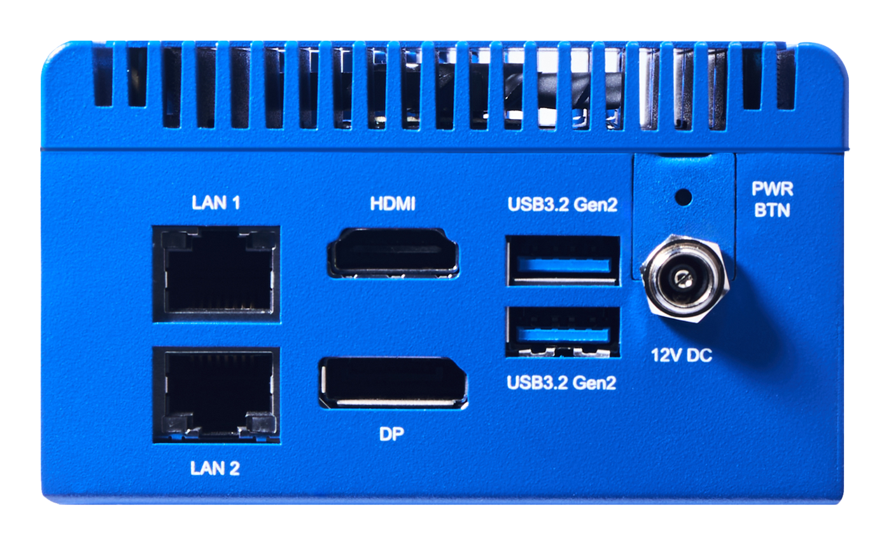
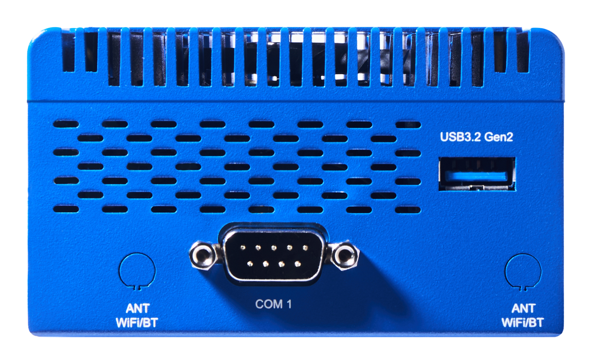
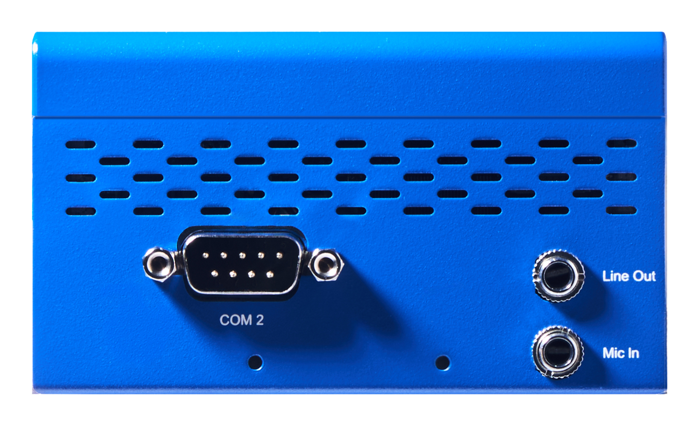

# DX-AIPlayer N97 — Getting Started Guide for AWS IoT Greengrass

This guide walks you through setting up AWS IoT Greengrass V2 on the DEEPX DX-AIPlayer N97 and verifying that the device communicates with AWS IoT services, from unboxing to deploying your first Greengrass component.

## Quick Start Path

Follow these five phases in order:

1. Understand the DX-AIPlayer N97 and its hardware.
2. Prepare the device, network, AWS account, and Greengrass prerequisites.
3. Install and register AWS IoT Greengrass.
4. Create and deploy a Hello World component.
5. Debug the setup or continue with DX-Edge runtime deployment.

## 1. Document information

### 1.1 Document revision history

| Revision | Date | Description |
|---|---|---|
| 1.0 | 2026-08-19 | Initial release |

### 1.2 Applicable operating systems for this guide

This guide applies to the DX-AIPlayer N97 system with an Intel® Processor N97 (x86_64) and an Ubuntu 24.04 LTS operating system running AWS IoT Greengrass.

| Role | Operating system |
|---|---|
| Device (DX-AIPlayer N97) | Ubuntu 24.04 LTS (64-bit, x86_64) |
| Host computer | Any OS with a web browser and an SSH client (Windows 10/11, macOS, or Linux) |

## Part I. Understand the device

## 2. Overview

The DX-AIPlayer N97 is a compact, fanless-class edge AI system built around an Intel® Processor N97 (x86_64) and the DEEPX DX-M1 AI accelerator (M.2 module), delivering up to 25 TOPS of AI inference performance at 1–5 W of accelerator power. With dual GbE LAN, USB 3.2, serial ports, and onboard storage, it is designed for vision AI, smart factory, retail analytics, and other edge applications that benefit from local AI inference combined with cloud connectivity through AWS IoT Greengrass.

Running Ubuntu 24.04 LTS, the DX-AIPlayer N97 hosts the AWS IoT Greengrass Core software (classic nucleus), enabling local execution of Greengrass components, messaging, data management, and secure communication with the AWS Cloud.

## 3. Hardware description

### 3.1 Datasheet

- Product page: https://deepx.ai/product/dx-aiplayer-n97/
- Product brochure (PDF): https://d3cq9fuihrmma1.cloudfront.net/wp-content/uploads/2026/05/11111133/DEEPX-DX-AIPlayer-N97-AI-Edge-Box-E-Brochure-1.pdf

Key specifications:

| Item | Specification |
|---|---|
| CPU | Intel® Processor N97, quad-core up to 3.6 GHz (x86_64) |
| AI Accelerator | DEEPX DX-M1 (M.2 2280 module), 25 TOPS INT8, 4 GB LPDDR5, max 5 W |
| Memory | 8 GB LPDDR5 |
| Storage | 64 GB eMMC onboard |
| Networking | 2x GbE LAN (RJ45); optional Wi-Fi/BT via M.2 2230 E-Key |
| USB | 3x USB 3.2 Gen 2 Type-A |
| Serial | 2x RS-232/422/485 COM ports |
| Display | HDMI 2.0b, DisplayPort 1.2 |
| Security | TPM 2.0 |
| Power | 12V DC-in, 5A (threaded locking barrel jack) |
| Operating temperature | 0°C to 60°C |
| Dimensions / Mounting | 95 x 95 x 55 mm / VESA mounting compatible |
| OS | Ubuntu 24.04 LTS |

### 3.2 Standard kit contents

- 1x DX-AIPlayer N97 unit (with DEEPX DX-M1 M.2 module pre-installed)
- 1x Power adapter (12V DC, 5A, threaded locking barrel jack)

### 3.3 User-provided items

- Ethernet cable for internet connectivity (or an optional M.2 2230 E-Key Wi-Fi module)
- USB keyboard/mouse and a monitor with HDMI or DisplayPort input for initial setup (or use SSH over the network)
- A host computer for remote access (optional after initial setup)

### 3.4 Third-party purchasable items

None.

## Part II. Prepare the environment

## 4. Development environment

### 4.1 Tools installation (IDEs, Toolchains, SDKs)

No device-specific IDE or toolchain is required to run AWS IoT Greengrass on the DX-AIPlayer N97. You will need:

- The AWS Command Line Interface (AWS CLI) on the device or host, if you prefer command-line setup. See [Installing the AWS CLI](https://docs.aws.amazon.com/cli/latest/userguide/getting-started-install.html).
- (Optional) To develop AI-accelerated Greengrass components using the DX-M1 accelerator, install the DEEPX DXNN® SDK. See the [DEEPX Technical Documentation](https://developer.deepx.ai/tech-docs).

## 5. Device hardware setup

The DX-AIPlayer N97 exposes its I/O on three faces. All ports are labeled on the chassis.

**Right side** — 2x GbE LAN (LAN 1 / LAN 2), HDMI, DisplayPort (DP), 2x USB 3.2 Gen 2, 12V DC power jack, power button:



**Left side** — COM 1 (RS-232/422/485), USB 3.2 Gen 2, Wi-Fi/BT antenna mounts:



**Back** — COM 2 (RS-232/422/485), Line Out, Mic In:



1. Place the device on a flat, ventilated surface.
2. Connect an Ethernet cable from your network (with internet access) to **LAN 1** on the right side.
3. (Initial setup) Connect a monitor (HDMI or DP, right side) and a USB keyboard, or note the device IP address for SSH access.
4. Connect the supplied power adapter to the **12V DC** jack on the right side and press the power button.
5. On first boot, complete the Ubuntu initial setup to create your user account, then log in with the account you created.

Verify internet connectivity:

```bash
ping -c 3 amazon.com
```

Install prerequisites. AWS IoT Greengrass Core software requires a Java Runtime Environment (Java 8 or greater) and common Linux utilities (already included in Ubuntu 24.04).

```bash
sudo apt update
sudo apt install -y default-jre curl unzip
java -version
```

## 6. AWS IoT Greengrass overview

To learn more about AWS IoT Greengrass, see [How AWS IoT Greengrass works](https://docs.aws.amazon.com/greengrass/v2/developerguide/how-it-works.html) and [What's new in AWS IoT Greengrass Version 2](https://docs.aws.amazon.com/greengrass/v2/developerguide/greengrass-v2-whats-new.html).

## 7. Greengrass prerequisites

Refer to the online documentation detailing the prerequisites needed for AWS IoT Greengrass. Follow the instructions in the following sections of [Tutorial: Getting started with AWS IoT Greengrass V2](https://docs.aws.amazon.com/greengrass/v2/developerguide/getting-started.html):

- [Step 1: Set up an AWS account](https://docs.aws.amazon.com/greengrass/v2/developerguide/getting-started-set-up-aws-account.html)
- [Step 2: Set up your environment](https://docs.aws.amazon.com/greengrass/v2/developerguide/getting-started-prerequisites.html)

## Part III. Install and register Greengrass

## 8. AWS IoT Greengrass installation

Follow the online guide to [Install the AWS IoT Greengrass Core software with automatic provisioning](https://docs.aws.amazon.com/greengrass/v2/developerguide/quick-installation.html). The steps below summarize the process on the DX-AIPlayer N97.

1. Provide AWS credentials to the device. For development environments, you can use long-term credentials from an IAM user:

```bash
export AWS_ACCESS_KEY_ID=<the access key id for your user>
export AWS_SECRET_ACCESS_KEY=<the secret access key for your user>
```

> **Security note**
>
> Use long-term IAM user credentials only for development and testing. For
> production environments, use an IAM role or temporary credentials instead,
> and follow your organization's credential management policy.

2. Download the AWS IoT Greengrass Core software:

```bash
cd ~
curl -s https://d2s8p88vqu9w66.cloudfront.net/releases/greengrass-nucleus-latest.zip -o greengrass-nucleus-latest.zip
unzip greengrass-nucleus-latest.zip -d GreengrassInstaller
```

3. Install the AWS IoT Greengrass Core software (replace the region, thing name, and group name as needed):

```bash
sudo -E java -Droot="/greengrass/v2" -Dlog.store=FILE \
  -jar ./GreengrassInstaller/lib/Greengrass.jar \
  --aws-region ap-northeast-2 \
  --thing-name DX-AIPlayer-N97-Core \
  --thing-group-name DXGreengrassGroup \
  --thing-policy-name GreengrassV2IoTThingPolicy \
  --tes-role-name GreengrassV2TokenExchangeRole \
  --tes-role-alias-name GreengrassCoreTokenExchangeRoleAlias \
  --component-default-user ggc_user:ggc_group \
  --provision true \
  --setup-system-service true
```

4. Verify that the Greengrass Core software is running:

```bash
sudo systemctl status greengrass.service
```

You can also verify in the AWS IoT console under **Greengrass devices > Core devices** that the device status is **Healthy**.

## Part IV. Deploy the first component

## 9. "Hello World" component

### 9.1 Create the component on your edge device

Follow the instructions online under [Develop and test a component on your device](https://docs.aws.amazon.com/greengrass/v2/developerguide/getting-started.html#create-first-component) to create a simple Hello World component locally on the DX-AIPlayer N97 and verify its output:

```bash
sudo tail -f /greengrass/v2/logs/com.example.HelloWorld.log
```

### 9.2 Upload the "Hello World" component

Follow the instructions online at [Create your component in the AWS IoT Greengrass service](https://docs.aws.amazon.com/greengrass/v2/developerguide/getting-started.html#upload-first-component) to upload your component to the cloud, where it can be deployed to other devices as needed.

### 9.3 Deploy your component

Follow the instructions online at [Deploy your component](https://docs.aws.amazon.com/greengrass/v2/developerguide/getting-started.html#deploy-first-component) to deploy the component from the AWS IoT console and verify that it is running on the device.

## Part V. Operate and troubleshoot

## 10. Debugging

- Greengrass Core logs are located at `/greengrass/v2/logs/greengrass.log`; component logs at `/greengrass/v2/logs/<component-name>.log`.
- To change the nucleus log level, see [Log levels](https://docs.aws.amazon.com/greengrass/v2/developerguide/monitor-logs.html).
- To view system boot and service messages: `journalctl -u greengrass.service -f`.

## 11. Troubleshooting

| Symptom | Resolution |
|---|---|
| Installer fails with `java: command not found` | Install Java: `sudo apt install -y default-jre`, then re-run the installer |
| Device does not appear in AWS IoT console | Check internet connectivity and that outbound TCP 443 to AWS endpoints is allowed by your firewall; verify the AWS region matches the console region |
| `greengrass.service` fails to start | Check `/greengrass/v2/logs/greengrass.log`; ensure `/tmp` is mounted with `exec` and the installation used `sudo` |
| Component deployment stuck | Verify the token exchange role was created (`--provision true` output) and check the deployment status in the console |

For more information, refer to the online documentation [Troubleshooting AWS IoT Greengrass V2](https://docs.aws.amazon.com/greengrass/v2/developerguide/troubleshooting.html).

For device-specific support, contact DEEPX at tech_support@deepx.ai or visit https://deepx.ai/contact-us/technical-support/

## Next steps — deploying the DEEPX runtime with DX-Edge

Once the device is registered with AWS IoT Core and included in a Thing Group, the DEEPX NPU driver, firmware, `dx_rt` runtime, and `dx_stream` media pipeline can be installed over the air, with no on-site work, using the **DEEPX Greengrass Solution** available on AWS Marketplace. See [DEEPX Greengrass Solution](01_DEEPX_Greengrass_Solution.md).

To compile your own ONNX models into the DEEPX NPU execution format on AWS, see [DEEPX Compiler Solution](02_DEEPX_Compiler_Solution.md).
